# NGINX Notes

* [NGINX Notes](#nginx-notes)
  * [安装](#安装)
    * [初始化工作环境](#初始化工作环境)
    * [准备源码包](#准备源码包)
    * [编译安装](#编译安装)
  * [运维](#运维)
    * [热升级/重启](#热升级重启)
    * [日志管理](#日志管理)
    * [日志时间](#日志时间)
    * [日志分析](#日志分析)
    * [日志清理](#日志清理)
    * [开机自启](#开机自启)
    * [监控](#监控)
      * [Vhost\_traffic](#vhost_traffic)
      * [Vhost\_traffic Prometheus](#vhost_traffic-prometheus)
      * [Vhost\_traffic Control](#vhost_traffic-control)
    * [高可用](#高可用)
      * [Keepalived](#keepalived)
  * [常用配置](#常用配置)
    * [长链接](#长链接)
      * [HTTP 长链接](#http-长链接)
      * [STREAM 长链接](#stream-长链接)
    * [反向代理](#反向代理)
      * [HTTP反向代理](#http反向代理)
      * [HTTPS反向代理](#https反向代理)
      * [NGINX域名处理](#nginx域名处理)
      * [代理上游HTTPS](#代理上游https)
    * [请求缓冲](#请求缓冲)
    * [代理缓冲](#代理缓冲)
    * [正向代理](#正向代理)
    * [静态缓存](#静态缓存)
    * [逻辑判断](#逻辑判断)
    * [正则匹配](#正则匹配)
    * [处理跨域](#处理跨域)
    * [密码认证](#密码认证)
    * [安全配置](#安全配置)
    * [压缩配置](#压缩配置)
    * [真实IP透传](#真实ip透传)
    * [区分浏览器](#区分浏览器)
    * [Cookie设置](#cookie设置)
    * [Websockets](#websockets)
    * [代理UDP协议](#代理udp协议)
    * [MAP控制上游](#map控制上游)
    * [其他配置/资料](#其他配置资料)
      * [location 失效](#location-失效)
      * [location 详解](#location-详解)
      * [proxy\_pass 后置处理](#proxy_pass-后置处理)
      * [root 和 alias](#root-和-alias)
      * [try\_files](#try_files)
      * [proxy\_redirect](#proxy_redirect)
      * [proxy\_cookie\_domain](#proxy_cookie_domain)
      * [proxy\_protocol](#proxy_protocol)
      * [reuseport](#reuseport)
      * [accept\_mutex](#accept_mutex)
      * [worker\_connections](#worker_connections)
      * [tcp\_nodelay](#tcp_nodelay)
      * [sendfile](#sendfile)
      * [tcp\_nopush](#tcp_nopush)
      * [multi\_accept](#multi_accept)
  * [常见的状态码问题分析](#常见的状态码问题分析)
    * [101](#101)
    * [400](#400)
    * [408](#408)
    * [413](#413)
  * [常用软件代理转发配置](#常用软件代理转发配置)
    * [Minio](#minio)
    * [Grafana](#grafana)
* [ANGIE](#angie)
  * [编译](#编译)
  * [国密支撑](#国密支撑)
    * [概念](#概念)
    * [国密CSR](#国密csr)
    * [配置](#配置)
* [备忘](#备忘)

## 安装

> 记录一些NGINX常用的安装步骤


NGINX版本（社区） 1.18.0 1.20.2

推荐的三方模块

* [vts-用于监控NGINX流量和状态](https://github.com/vozlt/nginx-module-vts)

* [proxy_connect-正向代理解决方案](https://github.com/chobits/ngx_http_proxy_connect_module)

* [dynamic_upstream-动态更新upstream server](https://github.com/cubicdaiya/ngx_dynamic_upstream)

推荐的参考网站

* [官方wiki](https://www.nginx.com/resources/wiki/)，其中有很多功指引和三方模块的收录


### 初始化工作环境

```markdown
yum -y install gcc gcc-c++ libtool make patch   
yum -y install pcre pcre-devel          
yum -y install zlib zlib-devel
yum -y install openssl openssl-devel
```

**注意**：openssl 版本 和TLS 版本有关

如果你的nginx需要支持 TLSv1.3 openssl需要使用较新的版本（例如 1.1.1g）


[Back To Toc](#nginx-notes)


### 准备源码包

从官网下载对应版本 [nginx: download](https://nginx.org/en/download.html)

如有需要的三方模块 前往对应 github页面下载 


推荐的NGINX编译目录

module 存放 三方模块源码

module_tar 存放 三方模块源码压缩包

```terminal
[root@nginx nginx_build]# pwd
/app/nginx_build
[root@nginx nginx_build]# tree -L 1
.
├── module
├── module_tar
├── nginx-1.18.0
├── nginx-1.18.0.tar.gz
├── nginx-1.20.2
└── nginx-1.20.2.tar.gz
```


[Back To Toc](#nginx-notes)


### 编译安装

> 常用官方模块 + 三方模块vts

```bash
cd /app/nginx_build
tar -zxvf nginx-1.20.2.tar.gz
cd nginx-1.20.2

./configure --prefix=/app/nginx/nginx-1.18.0 --with-compat --with-file-aio --with-threads --with-http_ssl_module --with-stream --with-stream_ssl_module --with-http_sub_module --add-module=/app/nginx_build/module/nginx-module-vts

make
make intall
```


> 常用官方模块 + 三方模块vts + 三方模块proxy_connect

```bash
cd /app/nginx_build
tar -zxvf nginx-1.20.2.tar.gz
cd nginx-1.20.2
patch -p1 < /app/nginx_build/module/ngx_http_proxy_connect_module/patch/proxy_connect_rewrite_1018.patch

./configure --prefix=/app/nginx --with-compat --with-file-aio --with-threads --with-http_ssl_module --with-stream --with-stream_ssl_module --with-http_sub_module --add-module=/app/nginx_build/module/nginx-module-vts --add-module=/app/nginx_build/module/ngx_http_proxy_connect_module

make
make intall
```


> 常用官方模块 + 编译NGINX Openssl版本升级(支持TLS 1.3) + 三方模块vts

openSSL升级

```bash
cd /app
wget https://www.openssl.org/source/openssl-1.1.1g.tar.gz
tar -xvf openssl-1.1.1g.tar.gz
cd openssl-1.1.1g
./config shared --openssldir=/usr/local/openssl --prefix=/usr/local/openssl
make && make install

echo "/usr/local/lib64/" >> /etc/ld.so.conf
ldconfig

mv /usr/bin/openssl /usr/bin/openssl.old
ln -s /usr/local/openssl/bin/openssl /usr/bin/openssl
ln -s /usr/local/openssl/include/openssl /usr/include/openssl
echo "/usr/local/openssl/lib" >> /etc/ld.so.conf

ldconfig -v
```

编译指定openSSL

```bash
cd /app/nginx_build
tar -zxvf nginx-1.20.2.tar.gz
cd nginx-1.20.2

./configure --prefix=/app/nginx --with-compat --with-file-aio --with-threads --with-http_ssl_module --with-stream --with-stream_ssl_module --with-http_sub_module --with-openssl=/app/openssl/openssl-1.1.1g --add-module=/app/nginx_build/module/nginx-module-vts

make
make intall
```

可以查看编译后版本验证相关信息（built with OpenSSL xxx）

```terminal
[root@lkarrie /]# /app/nginx/sbin/nginx -V
nginx version: nginx/1.20.2
built by gcc 4.8.5 20150623 (Red Hat 4.8.5-44) (GCC) 
built with OpenSSL 1.1.1g  21 Apr 2020
TLS SNI support enabled
configure arguments: --prefix=/app/nginx --with-compat --with-file-aio --with-threads --with-http_ssl_module --with-stream --with-stream_ssl_module --with-http_sub_module --with-openssl=/app/openssl/openssl-1.1.1g --add-module=/app/nginx_build/module/nginx-module-vts
```


推荐的NGINX安装目录

conf/cert 存放证书

script 存放keepalived探活脚本 或 一些定时任务脚本

```terminal
[root@lkarrie nginx]# pwd
/app/nginx
[root@lkarrie nginx]# tree -L 2
.
├── client_body_temp
├── conf
│   ├── cert
│   └── conf.d
├── fastcgi_temp
├── html
├── logs
│   └── nginx.pid
├── proxy_temp
├── sbin
├── scgi_temp
├── script
└── uwsgi_temp
```


[Back To Toc](#nginx-notes)


## 运维

> 记录一些常用的运维操作


### 热升级/重启

热升级或者热重启的使用场景：

* NGINX版本升级（替换可执行文件），保证流量的同时进行升级
* 在**开源社区版本**中NGINX会对本地DNS进行缓存，resolver配置未生效的情况下，只能热重启NGINX获取域名对应的最新IP

热升级具体操作如下

```markdown
# 进入nginx安装目录下的sbin目录
cd /app/nginx/sbin
# 备份二进制文件
cp -f nginx nginx.old
# 新二进制文件替换旧二进制文件
cp -f /app/nginx_build/nginx-1.20.2/objs/nginx .

# 执行升级和优雅关闭旧worker进程
# 69168 为NGINX的master进程号
kill -USR2 69168  
kill -WINCH 69168
        
# 确认升级后有无异常
# 如果有异常执行 故障回滚
# 恢复备份nginx二进制
# mv nginx.old nginx
# 唤醒旧master进程 创建正常worker进程
# kill -HUP 69168
# 优雅退出问题master进程
# kill -QUIT 77179

# 确认无误 无需回退
# 优雅退出旧master进程
kill -QUIT 69168
```

一点演示

```terminal
# 演示
# 升级前nginx版本 编译了nginx_upstream_check_module
[nginx@lkarrie sbin]$ ./nginx -V
nginx version: nginx/1.20.2
built by gcc 4.8.5 20150623 (Red Hat 4.8.5-44) (GCC) 
built with OpenSSL 1.0.2k-fips  26 Jan 2017
TLS SNI support enabled
configure arguments: --prefix=/app/nginx --with-compat --with-file-aio --with-threads --with-http_ssl_module --with-stream --with-stream_ssl_module --add-module=/app/nginx_build/module/nginx-module-vts-0.2.1 --add-module=/app/nginx_build/module/nginx_upstream_check_module

# 备份旧nginx二进制文件
[nginx@lkarrie sbin]$ cp -f nginx nginx.old
[nginx@lkarrie sbin]$ ls
nginx  nginx.commonbk  nginx.hpcbk  nginx.old

# 查看旧nginx进程号 
[nginx@lkarrie sbin]$ ps -ef | grep nginx
nginx   69168      1  0 04:26 ?        00:00:00 nginx: master process ../sbin/nginx
nginx   76801  69168  0 05:11 ?        00:00:00 nginx: worker process
nginx   76866  53248  0 05:12 pts/1    00:00:00 grep --color=auto nginx           

# 新nginx二进制文件 覆盖旧nginx二进制文件
[nginx@lkarrie sbin]$ mv /app/nginx_build/nginx-1.20.2/objs/nginx .
[nginx@lkarrie sbin]$ ls
nginx  nginx.commonbk  nginx.hpcbk  nginx.old

# 确认已经覆盖
[nginx@lkarrie sbin]$ ls -al
total 31940
drwxrwxr-x.  2 nginx nginx      77 Nov  7 05:13 .
drwxrwxr-x. 11 nginx nginx     151 Jul 13 19:43 ..
-rwxrwxr-x   1 nginx nginx 8212232 Nov  7 04:56 nginx

# 没有执行新二进制文件 所以进程pid无变化
[nginx@lkarrie sbin]$ ps -ef | grep nginx
nginx   69168      1  0 04:26 ?        00:00:00 nginx: master process ../sbin/nginx
nginx   76801  69168  0 05:11 ?        00:00:00 nginx: worker process
nginx   76959  53248  0 05:13 pts/1    00:00:00 grep --color=auto nginx

# 执行升级nginx二进制文件 USR2信号
[nginx@lkarrie sbin]$ kill -USR2 69168

# 启动新的nginx master worker进程
# 此时新旧nginx worker进程将同时处理请求
# 如果此时没有新的 master worker进程启动说明nginx conf配置存在异常 无法启动nginx
[nginx@lkarrie sbin]$ ps -ef | grep nginx
nginx   69168      1  0 04:26 ?        00:00:00 nginx: master process ../sbin/nginx
nginx   76801  69168  0 05:11 ?        00:00:00 nginx: worker process
nginx   77179  69168  0 05:16 ?        00:00:00 nginx: master process ../sbin/nginx
nginx   77180  77179  0 05:16 ?        00:00:00 nginx: worker process
nginx   77192  53248  0 05:16 pts/1    00:00:00 grep --color=auto nginx

# 优雅关闭旧nginx工作进程
# 有可能存在无法停止的旧worker进程 原因是流量较多或存在四层代理NGINX无法主动终止 
# 可以通过设置 worker_shutdown_timeout 在固定时间后强制终止旧worker进程
# 长时间无法停止可以尝试 kill -9 旧worker进程

# 此时只有新nginx worker进程处理请求
[nginx@lkarrie sbin]$ kill -WINCH 69168
[nginx@lkarrie sbin]$ ps -ef | grep nginx
nginx   69168      1  0 04:26 ?        00:00:00 nginx: master process ../sbin/nginx
nginx   77179  69168  0 05:16 ?        00:00:00 nginx: master process ../sbin/nginx
nginx   77180  77179  0 05:16 ?        00:00:00 nginx: worker process
nginx   77413  53248  0 05:18 pts/1    00:00:00 grep --color=auto nginx

# 验证更新 nginx_upstream_check_module去除 新增ngx_dynamic_upstream
[nginx@lkarrie sbin]$ ./nginx -V
nginx version: nginx/1.20.2
built by gcc 4.8.5 20150623 (Red Hat 4.8.5-44) (GCC) 
built with OpenSSL 1.0.2k-fips  26 Jan 2017
TLS SNI support enabled
configure arguments: --prefix=/app/nginx --with-compat --with-file-aio --with-threads --with-http_ssl_module --with-stream --with-stream_ssl_module --add-module=/app/nginx_build/module/nginx-module-vts --add-module=/app/nginx_build/module/ngx_dynamic_upstream

# 运行一段时间新nginx进程 业务无明显抖动 无其他异常现象 即可退出旧nginx master进程
[nginx@lkarrie sbin]$ kill -QUIT 69168
# 注意 
# 如果旧worker进程没有完全停止 kill -QUIT 无法关闭旧master进程
# 需要等待所有旧worker进程退出后 再执行kill -QUIT 退出旧master进程


# 在没有退出旧nginx master进程之前 如果有不可控因素导致需要故障回滚
# 下面演示回滚步骤

# 旧nginx二进制文件 覆盖问题nginx二进制执行文件
[nginx@lkarrie sbin]$ mv nginx.old nginx

# 确认旧nginx执行文件替换成功
[nginx@lkarrie sbin]$ ./nginx -V
nginx version: nginx/1.20.2
built by gcc 4.8.5 20150623 (Red Hat 4.8.5-44) (GCC) 
built with OpenSSL 1.0.2k-fips  26 Jan 2017
TLS SNI support enabled
configure arguments: --prefix=/app/nginx --with-compat --with-file-aio --with-threads --with-http_ssl_module --with-stream --with-stream_ssl_module --add-module=/app/nginx_build/module/nginx-module-vts-0.2.1 --add-module=/app/nginx_build/module/nginx_upstream_check_module

# 旧nginx master进程存在
[nginx@lkarrie sbin]$ ps -ef | grep nginx
nginx   69168      1  0 04:26 ?        00:00:00 nginx: master process ../sbin/nginx
nginx   77179  69168  0 05:16 ?        00:00:00 nginx: master process ../sbin/nginx
nginx   77180  77179  0 05:16 ?        00:00:00 nginx: worker process
nginx   78267  53248  0 05:28 pts/1    00:00:00 grep --color=auto nginx

# 唤醒旧nginx master进程 执行旧nginx二进制执行文件
[nginx@lkarrie sbin]$ kill -HUP 69168

# 旧nginx worker参与nginx请求处理
[nginx@lkarrie sbin]$ ps -ef | grep nginx
nginx   69168      1  0 04:26 ?        00:00:00 nginx: master process ../sbin/nginx
nginx   77179  69168  0 05:16 ?        00:00:00 nginx: master process ../sbin/nginx
nginx   77180  77179  0 05:16 ?        00:00:00 nginx: worker process
nginx   78336  69168  0 05:29 ?        00:00:00 nginx: worker process
nginx   78345  53248  0 05:29 pts/1    00:00:00 grep --color=auto nginx

# 优雅关闭问题nginx主进程和工作进程
[nginx@lkarrie sbin]$ kill -QUIT 77179

# 升级故障回滚完毕
[nginx@lkarrie sbin]$ ps -ef | grep nginx
nginx   69168      1  0 04:26 ?        00:00:00 nginx: master process ../sbin/nginx
nginx   78336  69168  0 05:29 ?        00:00:00 nginx: worker process
nginx   78562  53248  0 05:32 pts/1    00:00:00 grep --color=auto nginx

# 验证
[nginx@lkarrie sbin]$ ./nginx -V
nginx version: nginx/1.20.2
built by gcc 4.8.5 20150623 (Red Hat 4.8.5-44) (GCC) 
built with OpenSSL 1.0.2k-fips  26 Jan 2017
TLS SNI support enabled
configure arguments: --prefix=/app/nginx --with-compat --with-file-aio --with-threads --with-http_ssl_module --with-stream --with-stream_ssl_module --add-module=/app/nginx_build/module/nginx-module-vts-0.2.1 --add-module=/app/nginx_build/module/nginx_upstream_check_module
```

**注**：上述演示的是升级操作，执行热重启不需要更换二进制文件，直接发送USR2 WINCH QUIT信号即可


[Back To Toc](#nginx-notes)


### 日志管理

生产实践中，NGINX日志需要固定目录，供filebeat（或其他日志全家桶）抓取灌入可视化页面（例如kibana）中展示

而且NGINX日志格式需要有一些要求，方便排查线上问题

推荐的日志文件名和路径

* access日志（七层）：/app/logs/nginx/access-$server_name-$server_port-$logdate.log

* access日志（四层）：/app/logs/nginx/access-$protocol-$server_port-$logdate.log

* error日志：/app/logs/nginx/error.log

具体配置如下

**注**：日志配置实现了按天自动切割 access.log

```nginx
http{
    
    #....
    
    map $time_iso8601 $logdate {
        '~^(?<ymd>\d{4}-\d{2}-\d{2})' $ymd;
        default    'date-not-found';
    }
    
    #日志 变量含义
    #$request_length:
    #request length (including request line, header, and request body)

    #$bytes_sent:
    #response length (including header, and body)

    #$body_bytes_sent:
    #response length only include body.
    
    log_format  access  '[$time_iso8601] $remote_user $remote_addr:$remote_port "$server_protocol $request_method $scheme://$http_host$request_uri" '
                        '$status $body_bytes_sent $request_time $request_length "$http_referer" '
                        '"$http_user_agent" "$http_x_forwarded_for" '
                        '"$upstream_addr" $upstream_status $upstream_response_time';
                    
    access_log /app/logs/nginx/access-$server_name-$server_port-$logdate.log access;
    
    #....
}

stream{

    #....
    map $time_iso8601 $logdate {
      '~^(?<ymd>\d{4}-\d{2}-\d{2})' $ymd;
      default    'date-not-found';
    }

    log_format stream '[$time_iso8601] $remote_addr:$remote_port $protocol $server_addr:$server_port '
                    '$status $bytes_sent $bytes_received $session_time '
                    '"$upstream_addr" "$upstream_bytes_received" "$upstream_bytes_sent" "$upstream_connect_time"';

    access_log /app/logs/nginx/access-$protocol-$server_port-$logdate.log stream;
    #....
}
```


当然NGINX的日志切割也可以使用logrotate，下面是具体方法（直接使用配置实现日志切割较为方便

使用logrotate工具切割，crontab定时每天0点切割access.log和error.log，保存每天0-24时nginx日志

执行命令 vim /app/logs/nginx/nginx-logrotate-conf 创建如下配置文件

```shell
/app/logs/nginx/*.log
{  
    daily 
    rotate 30
    dateext
    create 0644 nginx nginx 
    compress
    delaycompress
    notifempty
    sharedscripts 
    postrotate
      ProcNumber=$(ps -ef |grep -w nginx|wc -l)
      if [ ${ProcNumber} -gt 1 ];then  
        nginx -s reopen
      fi
    endscript
}
```

执行命令 crontab -e 创建定时任务

```shell
0 0 * * * /usr/sbin/logrotate -f /app/logs/nginx/nginx-logrotate-conf >/dev/null 2>&1
```


[Back To Toc](#nginx-notes)


### 日志时间

NGINX日志的时间显示，是一个很重要但是很容易被忽视的问题，下面是一些我在生产实践中的总结

* $time_iso8601 显示的是本地时间，这个时间参数记录的是**请求在NGINX上结束处理的时间，而不是请求开始时间**，例如：某个请求耗时3s（$request_time），nginx上输出的时间为 2023-11-13T09:22:16+08:00 ，这时如果进行抓包，第一个达到NGINX包的时间应该是 2023-11-13T09:22:16 减去 3s

* 时间格式如果需要支持显示到毫秒，可以利用变量 $msec

nginx显示毫秒时间的参考配置如下

```nginx
http{
   	...
        
    
    # 使用 逗号拼接毫秒时间 便于阅读 但是一些工具不好解析 比如 logstash
    map $msec $time_iso8601_ms { ~(.*)\.(.*) $time_iso8601,$2; }
    # 单独显示 毫秒时间
    map $msec $only_ms { ~(.*)\.(.*) $2; }
    # 去除逗号 显示包括毫秒的时间戳
    map $msec $msec_no_decimal { ~(.*)\.(.*) $1$2; }
    
    log_format  access  '[$time_iso8601] [$time_iso8601_ms] [$msec_no_decimal] [$only_ms] $remote_user $remote_addr:$remote_port "$server_protocol $request_method $scheme://$http_host$request_uri" '
                    '$status $body_bytes_sent $request_time $request_length "$http_referer" '
                    '"$http_user_agent" "$http_x_forwarded_for" '
                    '"$upstream_addr" $upstream_status $upstream_response_time';

    ...
}
```


[Back To Toc](#nginx-notes)


### 日志分析

日志分析相关，还是最好收拢到ES里，方便检索

下面补充一些小工具分析

goaccess分析日志 [整好之后的效果]([服务器统计信息 (lkarrie.com)](http://goaccess.lkarrie.com/goaccess/))

```markdown
# 离线ip库
yum install -y GeoIP-devel --downloadonly --downloaddir=./
yum install GeoIP-1.5.0-14.el7.x86_64.rpm GeoIP-devel-1.5.0-14.el7.x86_64.rpm geoipupdate-2.5.0-1.el7.x86_64.rpm -y

# 安装goaccess
wget https://tar.goaccess.io/goaccess-1.7.2.tar.gz
tar -xzvf goaccess-1.7.2.tar.gz
cd goaccess-1.7.2
./configure --enable-utf8 --enable-geoip=legacy --with-getline --with-openssl
make
make install

# 配置
vim /usr/local/etc/goaccess/goaccess.conf
# 增加配置
time-format %T
date-format %Y-%m-%d
log-format [%dT%t+%^] %^ %h:%^ "%H %m %^ %v %U" %s %b %T %^ "%R" "%u" "~h{,}"  %^ %^ %^

# 注意这里需要根据自己的 nginx logformat进行配置
# 参考官方文档 https://goaccess.io/man#custom-log
# 上面配置对应的 log_format
log_format  access  '[$time_iso8601] $remote_user $remote_addr:$remote_port "$server_protocol $request_method $scheme $http_host $uri" '
'$status $body_bytes_sent $request_time $request_length "$http_referer" '
'"$http_user_agent" "$http_x_forwarded_for" '
'"$upstream_addr" $upstream_status $upstream_response_time';
##### 

# 跑一下生成html
# 可以写脚本放到后台跑
# nginx加一下配置就能实时访问这个资源了
# 注意开放 websocket 7890端口
goaccess /app/logs/nginx/access.log -o /app/nginx/html/goaccess/index.html --real-time-html
```


[Back To Toc](#nginx-notes)


### 日志清理

按天切割NGINX日志后，产生的日志文件时间久了会堆积很多，需要清理日志文件

删除7天前的access log 

创建清理日志脚本 nginx_access_log_clean.sh

```shell
#!/bin/bash
find /app/logs/nginx/ -mtime +6 -name "access-*.log" -exec rm -f {} \;
```


执行命令 crontab -e 创建定时任务

```shell
@daily /app/nginx/script/nginx_access_log_clean.sh
```


[Back To Toc](#nginx-notes)


### 开机自启

利用crontab

**注**：注意添加 -c -p 参数，如果需要覆盖NGINX编译参数的话，crontab -e 添加定时任务，crontab -l 查看定时任务

```shell
@reboot /app/nginx/sbin/nginx
```


[Back To Toc](#nginx-notes)


### 监控

社区版本的NGINX监控手段其实不多，可用的module [ngx_http_stub_status_module](https://nginx.org/en/docs/http/ngx_http_stub_status_module.html) 展示的内容也太少了

如果你用的是开源社区版本的NGINX，非常推荐使用一下三方模块 [vts](https://github.com/vozlt/nginx-module-vts) 这个真是一个良心的模块 

NGINX 构建加入这个模块之后 添加一些vts配置 即可以通过 Web页面或Prometheus指标 查看NGINX的很多信息

```nginx
http{
    
    # ....
    # 设置 vts共享内存
    vhost_traffic_status_zone;
    # 开启自定义filter分组监控
    vhost_traffic_status_filter on;
    # 按请求状态和配置server_name 分组
    vhost_traffic_status_filter_by_set_key $status $server_name;

    # 访问 vts 监控的 server 配置
    server {
         # 访问 vts 监控的端口
         listen 9913;
         # 访问 vts 监控的路径
         location /status {
           access_log off;
           # 不记录当前location的请求信息
           vhost_traffic_status_bypass_stats on;
           # 允许自身访问 例如 curl测试
           allow 127.0.0.1;
           # allow prometheus ip
           # allow 1.1.1.1;    
           # 禁止除了白名单ip以外的所有访问 这个很重要 
           deny all;
           # 默认展示 html 页面显示监控状态
           vhost_traffic_status_display;
           vhost_traffic_status_display_format html;
         } 
    } 
    
    # ....
}
```


#### Vhost_traffic

引用一下官方的一张图，展示一下vts的监控html页面


详细分析一下这个html展示的内容

* Server Main 

  server main 主要展示了 当前NGINX的总体状态，例如运行机器的 hostname、nginx版本、nginx进程最后一次更新或启动到现在的时间、总体的链接情况、总体的请求情况、和vts所依赖的共享内存的区域状态（vts模块记录的这些指标存储在这里）

  

  

* Server Zone

  server zone 主要是对每一个 server 配置下面的 请求处理的状态，你可以查看你的每一个nginx server 配置下的请求状态（例如请求响应状态1xx 2xx 3xx 4xx 5xx的情况、流量情况等）

  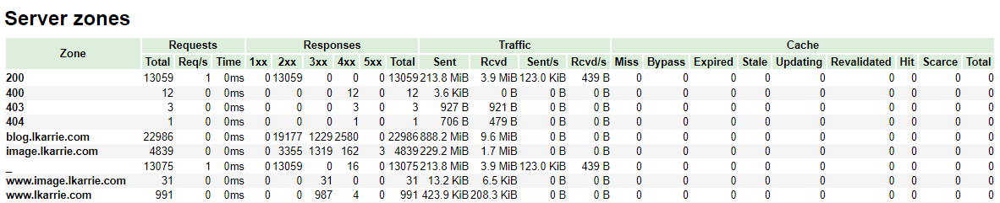

  **注意**：如果没有设置server_name的server server_name 会缺省为 "_" ；

  如果 vhost_traffic_status_filter_by_set_key 第一个 第二个 参数分别为 $status $server_name ；

  由于第二个参数为空 Server Zone会以第一个参数生成Zone ；

  例如上图的 200，400，都是由于存在server_name为空的server，自动设置了对应状态码的Zone，并展示了相关的请求数据；

  

* Filters

  filters 在官方的样例图中没有具体展示，但是它很重要，主要是通过filter来实现自定监控项

  官方配置中和filters相关的配置如下

  ```nginx
  http{
      #...
      # 开启自定义filter分组监控
      vhost_traffic_status_filter on;
      # 按请求状态和配置server_name 分组
      # 下面vts配置 是设置监控 每个nginx server下的具体请求状态码
      vhost_traffic_status_filter_by_set_key $status $server_name;
      #...
      # 下面配置一些自己的server和vts无关
      server {
          #...
          server_name *.lkarrie.com;
          #...
  	}
      server {
          #...
          server_name blog.lkarrie.com;
          #...
      }
      #...
  }
  ```

  实现效果如下，可以看到filters对应的group为server下的server_name，每个gourp监控的key为具体的httpcode 200、206、301等等

  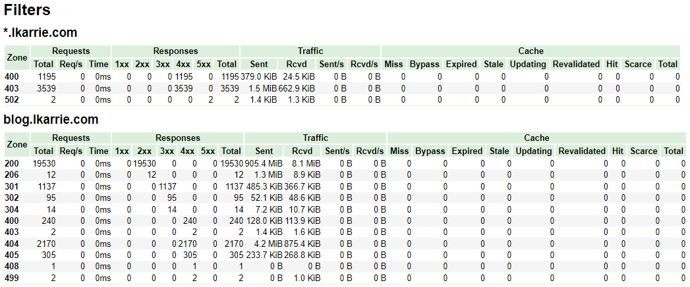

  **vhost_traffic_status_filter_by_set_key 后关于key的设置除了 $status 也可以设置其他变量，如果设置了其他变量就相当于监控每个server下的这个变量维度的1xx 2xx 3xx 4xx 5xx 出入流量 等状态**

  举个监控server下具体接口状态的例子，增加一个自定义变量捕获特定的接口

  按照如下的配置，最终filters下的Zone为自定义变量$alerturl

  当然你可以根据实际的需求将map下的正则规则进行修改，实现特定规则的接口监控

  ```nginx
  http{
      #...
      # 当请求路径包含gateway时 为$alerturl设置为当前请求的uri
      # 不包含gateway的请求$alerturl统一设置为/not-alarm-request
      map $uri $alerturl {
          ~*(gateway) $uri;
          default '/not-alarm-request';
      }
      
      # 自定义 vts共享内存
      # 由于我们监控的接口可能一直增长或数量较多 需要适当调整vts共享内存的默认大小
      # 满了虽然不会影响使用，但是会停止记录新的key
      vhost_traffic_status_zone shared:vhost_traffic_status:300m;
      # 开启自定义filter分组监控
      vhost_traffic_status_filter on;
      # 按请求状态和配置server_name 分组
      vhost_traffic_status_filter_by_set_key $alerturl $server_name;
      #...
  }
  ```

  

* Upstreams

  upstream主要包含了upstream包含的server信息，例如当前server被动探测的参数 up/down状态 以及1xx 2xx 3xx 4xx 5xx 和 出入流量的信息

  ```nginx
  http{
      #...
      upstream group1 {
          # 按upstream的名称（group1）展示upstream下的server信息
          server 127.0.0.1:8080;
          server 127.0.0.1:8081;
      }
      #...
  }
  ```

  可以通过这里的信息判断上游的节点是否存活、或者根据响应时间判断上游是否存在异常

  **注意**：需要额外说明一下 ::nogroups 下server展示的是未用upstream声明的上游地址（在 proxy_pass 后置设置的地址）

  ```nginx
  http{
      #...
      server{
          #...
          location / {
              # proxy_pass 后直接配置实际地址的状态 vts将在::nogroups下展示
              proxy_pass http://127.0.0.1:8082;
          }
          #...
      }
      #...
  }
  ```

  

* Caches

  关于Caches个人暂时还没有用到，vts上没有相关展示，应该和nginx缓存配置相关，后续使用到了再补充


#### Vhost_traffic Prometheus


当然除了使用html方式你通过http的形式获取vts的Prometheus指标

```terminal
# 通过format/prometheus 请求vts配置返回Prometheus指标
[root@lkarrie ~]# curl http://127.0.0.1:9913/status/format/prometheus
# HELP nginx_vts_info Nginx info
# TYPE nginx_vts_info gauge
nginx_vts_info{hostname="lkarrie",module_version="v0.2.1",version="1.20.2"} 1
# HELP nginx_vts_start_time_seconds Nginx start time
# TYPE nginx_vts_start_time_seconds gauge
nginx_vts_start_time_seconds 1686053290.672
```

既然它支持输出Prometheus指标，当然就可以展示到Grafana中或对接Prometheus Alertmanager 根据Nginx Vts指标进行告警，实际生产中我们也是正是这么做的

有一些改动的Nginx Vts Grafana监控大盘

  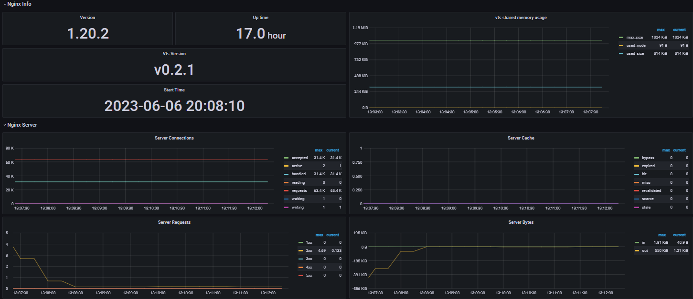


#### Vhost_traffic Control

vts模块除了可以展示NGINX状态，还支持一些http接口形式的动态控制，下面是一些个人常用的控制接口，详细可以参考官方Github Readme的介绍

```markdown
# 注意 curl的地址 必须使用单引号括起来 否则无法正常生效

# 删除所有zone重新计数
curl 'http://127.0.0.1:9913/status/control?cmd=delete&group=*'

# 获取Main zone
curl 'http://127.0.0.1:9913/status/control?cmd=status&group=server&zone=::main'
```


[Back To Toc](#nginx-notes)


### 高可用

* 在传统虚机部署中，你可以依赖keepalived做软VIP的主备架构

  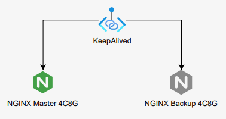


* 或者依赖硬件设备（F5等），做负载均衡形成集群

  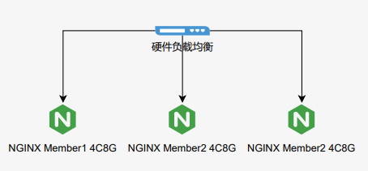


* 再者就是上云依赖平台底座例如K8S等，提供容错、自愈、和横向扩展的功能


#### Keepalived

简单补充一下 Keepalived 的安装方法

```markdown
# yum安装
yum -y install keepalived

# 查看安装路径
rpm -ql keepalived

# 备份默认配置
cd /etc/keepalived
mv keepalived.conf  keepalived.conf.default 
```

测试部署主备节点：192.168.202.129，192.168.202.130 ；VIP：192.168.202.130

编辑 192.168.202.129  keepalived.conf 配置 

``` keepalived.conf
global_defs { 
    # 全局唯一的主机标识,主备机使用不同的标识 
    router_id server_a 
    script_user root
    enable_script_security
} 

vrrp_script check_app {
    script "/etc/keepalived/nginx_check.sh"
    interval 3
}
vrrp_instance VI_1 { 
    state BACKUP 
    # 绑定的网卡  
    interface ens33 
    # 虚拟路由id，保证主备节点是一致的  
    virtual_router_id 51 
    # 权重  
    priority 100 
    # 同步检查时间，间隔默认1秒  
    advert_int 1
    # 非抢占模式
    nopreempt
    # 本机地址
    unicast_src_ip 192.168.202.129 
    unicast_peer { 
        # 备机地址
        192.168.202.130
    } 
    # 认证授权的密码，所有主备需要一样  
    authentication { 
        auth_type PASS 
        auth_pass 1111 
    }
    
    track_script {
        check_app
    } 
    virtual_ipaddress { 
        # VIP
        192.168.202.131 
    } 
} 
```

编辑 192.168.202.130  keepalived.conf 配置 

```keepalived.conf
global_defs { 
    # 全局唯一的主机标识,主备机使用不用的标识 
    router_id server_a 
    script_user root
    enable_script_security
} 

vrrp_script check_app {
    script "/etc/keepalived/nginx_check.sh"
    interval 3
}
vrrp_instance VI_1 { 
    state BACKUP 
    # 绑定的网卡  
    interface ens33 
    # 虚拟路由id，保证主备节点是一致的  
    virtual_router_id 51 
    # 权重  
    priority 100 
    # 同步检查时间，间隔默认1秒  
    advert_int 1
    # 非抢占模式
    nopreempt
    # 本机地址
    unicast_src_ip 192.168.202.130 
    unicast_peer { 
        # 备机地址
        192.168.202.129
    } 
    # 认证授权的密码，所有主备需要一样  
    authentication { 
        auth_type PASS 
        auth_pass 1111 
    }
    
    track_script {
        check_app
    } 
    virtual_ipaddress { 
        # VIP
        192.168.202.131 
    } 
} 
```

两测试机 /etc/keepalived 目录下分别创建 nginx_check.sh

```shell
#!/bin/bash
# 检测NGINX进程
A=`ps -C nginx --no-header | wc -l`
# 没有探测到NGINX进程
if [ $A -eq 0 ];then
    # 可以先尝试拉起NGINX
    # su - nginx -c "/app/nginx/sbin/nginx"
    # sleep 3
    # if [ `ps -C nginx --no-header | wc -l` -eq 0 ];then
    #     killall keepalived
    # fi
    
    # 或者直接停止keepalived
    systemctl stop keepalived   
fi
```

**为nginx_check.sh脚本赋权**，这一步非常重要脚本权限不对会影响keepalived执行脚本进行VIP漂移

```shell
chmod 700 nginx_check.sh
```

分别启动keepalived，亲测无问题，停止nginx进程VIP可以进行漂移

```shell
systemctl restart keepalived
```

测试记录~

主节点 192.168.202.130

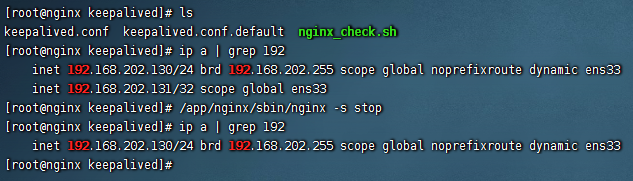

备节点 192.168.202.129

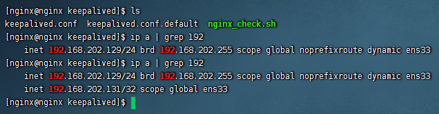

**注意**：

实际使用中，按上述测试的方法，宕机机器再重启后 keepalived 不会自动启动，需要手动拉起

当然你也可以做一些脚本，让 keepalived 也自动启动


[Back To Toc](#nginx-notes)


## 常用配置

> 记录一些生产实践过程中常用的NGINX配置


### 长链接

#### HTTP 长链接

在NGINX 七层代理中使用长链接（复用TCP通道）

实际生产中 keepalive 设置的值需要慎重，而且这个值是单独指定一个worker进程，实际的keepalive数需要和worker进程相乘，推荐根据实际业务的tps推算到每个worker进程的keepalive链接数并做微上调，保证需求避免keepalive设置值不合理

```nginx
http{
    #...
    upstream keepalive {
        server 192.168.0.4:8080;
        server 192.168.0.5:8080;
        # 最大空闲的keepalive链接数
        # 需要注意这个配置并不是限制 keepalive的链接数
        keepalive 32;
        # 单个keepalive链接最大处理的请求数
        keepalive_requests 10000;
        # 空闲最大时间
        keepalive_timeout 60s;
        # 最大存活时间 1.19.10 版本后可配置
        keepalive_time 1h;
    }
    
    server {
        listen 8000;
        location / {
            proxy_set_header Connection "";
            proxy_http_version 1.1;
            proxy_pass http://keepalive;
        }
    }
    #...
}
```


[Back To Toc](#nginx-notes)


#### STREAM 长链接

在NGINX的四层代理中使用长链接

```nginx
stream {
    #...
    proxy_connect_timeout 5s;
    proxy_socket_keepalive on;
    
    upstream test {
        server 192.168.0.3:2000;
    }
    
    server {
        listen 2001 so_keepalive=on;
        proxy_pass test;
    }
    #...
}
```


[Back To Toc](#nginx-notes)


### 反向代理

> 反向代理主要指客户端访问代理服务器（NGINX）之后，反向代理服务器（NGINX）根据一定的规则（location、proxy_pass）从被一个或多个被代理服务器中获取响应资源并返回给客户端的模式

反向代理有两种

* http的反向代理

  http的反向代理在日常工作中用的最多，在局域网中可以利用nginx反向代理将应用的外发流量转到对应的合作方机构

* https的反向代理

  https的反向代理通常放在dmz区域，做静态资源的代理，这种也叫做NGINX的SSL卸载或者终止


#### HTTP反向代理

HTTP的反向代理并不困难，不论对内或对外都是配置proxy_pass即可，但是实际生产使用中，对外的反向代理其实是很复杂的，通常对方只会提供给我们一个域名，反向代理域名的情况下，就会涉及域名的动态解析、实际IP的缓存、甚至NGINX与DNS服务器的交互的问题等等

下面的一些配置仅针对**NGINX社区版本**，商业版本的NGINX Plus对上面的一些实际问题都有很好的解决方案（并不是所有老板都有钱支持采购商业版本~

默认如果你的配置文件里 proxy_pass 存在域名，而且resolver未生效的情况下，nginx只会在首次启动时（进程完全退出后启动）将域名对应的实际地址缓存到内存中，这个时候如果域名对应的实际地址变化之后，nginx其实是探测不到的

**在官方文档中，上述的情况是可以通过配置 resolver的 valid 参数来设置域名对应实际IP的时间，但在我工作当中用到的 1.18.0 1.20.2 NGINX这个参数并不能生效**...

最后我通过变量设置域名的方式，保证了域名对应实际IP的新鲜度，下面是一些参考配置

```nginx
http {
    #...
    server {
        #...
        set $baidu www.baidu.com
        resolver 192.168.0.2 ipv6=off valid=30s;
        resolver_timeout 3s;
        
        location / {
            proxy_pass https://$baidu:8443;
            proxy_set_header Host $baidu;
        }
        #...
    }
    #...
}
```

**注意**：上述的配置其实也是有弊端的，变量是无法在upstream中使用的，如果不使用upstream，nginx http的长链接就无法使用了，只能全部通过短连接方式，如果想使用长链接，并且upstream server中配置了域名，这又无法做到域名对应实际ip地址的动态更新了


[Back To Toc](#nginx-notes)


#### HTTPS反向代理

HTTPS我使用的不是很多，目前工作中SSL卸载是在硬件上实现的，证书同样也是在硬件上

后续生产实践中使用积累经验或遇到事故问题再补充补充

推荐一个SSL 配置生成网站，可以一键生成NGINX的SSL配置

[Mozilla SSL Configuration Generator](https://ssl-config.mozilla.org/)

下面是个人博客使用到的一些配置，仅供参考

```nginx
http {
    #...
    server {
        listen 443 ssl;
        server_name lkarrie.com;
        ssl_certificate  cert/root/lkarrie.com.pem;
        ssl_certificate_key cert/root/lkarrie.com.key;
        ssl_protocols TLSv1.2 TLSv1.3;
        ssl_ciphers ECDHE-ECDSA-AES128-GCM-SHA256:ECDHE-RSA-AES128-GCM-SHA256:ECDHE-ECDSA-AES256-GCM-SHA384:ECDHE-RSA-AES256-GCM-SHA384:ECDHE-ECDSA-CHACHA20-POLY1305:ECDHE-RSA-CHACHA20-POLY1305:DHE-RSA-AES128-GCM-SHA256:DHE-RSA-AES256-GCM-SHA384:DHE-RSA-CHACHA20-POLY1305;        
        ssl_prefer_server_ciphers off;

        rewrite ^(.*) https://blog.lkarrie.com$1 permanent;
	}
    #...
}
```

**注意**：如果你的网站配置了 ssl_protocols TLSv1.3，但是检测网站TLS支持版本并不包含TLS 1.3，大概率是NGINX编译的openssl版本并不支持TLS 1.3


[Back To Toc](#nginx-notes)


####	NGINX域名处理

在反向代理中提了一些域名解析的问题，下面主要记录一下NGINX域名的处理逻辑

**测试版本 1.20.2**

```nginx
server {
	listen 9001;
	resolver 192.168.202.129 valid=180s ipv6=off;
	set $test test.cs107.net;
	location / {

		# proxy_pass http://test.cs107.net;
		# proxy_set_header Host test.cs107.net;

		# 当前server resolver 配置正常生效
		# 可以正常启动 启动时不会获取并缓存变量域名对应的IP
		# 第一次请求时 请求resolver获取变量域名对应IP
		# valid 时间后 域名缓存IP失效 重新请求resolver获取域名地址
		proxy_pass http://$test;
		proxy_set_header Host $test;
	}
}

server {
	listen 9001;
	resolver 192.168.202.129 valid=180s ipv6=off;
	#set $test test.cs107.net;
	location / {

		# 当前server resolver 配置失效
		# 虽然配置了resolver 但是实际并没有 通过resolver去获取域名对应IP
		# 通过 /etc/resolver.conf 下的nameserver获取域名对应的IP 
		# 并且一直缓存在NGINX中不会更新 
		proxy_pass http://test.cs107.net;
		proxy_set_header Host test.cs107.net;

		#proxy_pass http://$test;
		#proxy_set_header Host $test;
	}
}
```


[Back To Toc](#nginx-notes)


#### 代理上游HTTPS

反向代理上游服务器是HTTPS时，你可能见过这种错误

> SSL_do_handshake() failed (SSL：error：14077438：SSL routines：SSL23_GET_SERVER_HELLO：tlsv1 alert internal error) ...

上述错误是TLS 握手时 证书 SNI 校验失败导致的，看error.log并不能很明显的看出原因

下面时反向代理上游是HTTPS可能使用的配置

```nginx
server {
	listen 80;
	location / {
        # 上游地址： https://test.com;
        proxy_pass https://127.0.0.1:443;
        # 设置 Host 头
        proxy_set_header Host test.com;
        # 启用将 server_name 添加到 client hello extension 字段中 
        # 启用SNI 
        proxy_ssl_server_name on;
        # 覆盖SNI 传递的域名字段 用于证书校验
        proxy_ssl_name test.com;
        # 算法
        proxy_ssl_ciphers ECDHE-ECDSA-AES128-GCM-SHA256;
        # 协议版本
        proxy_ssl_protocols TLSv1.2 TLSv1.3;
        # 配置客户端证书
        proxy_ssl_certificate     cert/client.pem;
        # 配置客户端密钥
        proxy_ssl_certificate_key cert/client.key;
		
        # 开启证书校验 默认不开启
        proxy_ssl_verify on;
        # 被信任的CA机构证书
        proxy_ssl_trusted_certificate cert/trusted_ca_cert.crt;
        # 验证深度（顶级CA机构->下层CA机构）
		proxy_ssl_verify_depth 2;
        
        # 复用SSL握手会话 加速连接
		proxy_ssl_session_reuse on;
	}
}
```


[Back To Toc](#nginx-notes)


### 请求缓冲

请求缓冲指 读取请求时 client_body_buffer_size 的相关配置，相关概念比较容易忘记或混淆，笔记一下

```nginx
http {
    # ...

    # 设置请求体最大值
    # 默认 1m
    # 设置 0 关闭请求体校验
    client_max_body_size 1m;

    # 设置读取请求体的缓存区大小 超过此大小将 写入临时文件
    client_body_buffer_size 8k;

    # 限制请求头的大小
    # 请求头 例如 Host lkarrie.com
    # 超过此值 large_client_header_buffers 配置生效
    client_header_buffer_size 1k;

    # 限制超过 client_header_buffer_size 的请求 请求行和请求头大小
    # 请求行(request line)的大小不能超过 8k（设置值） 否则返回414 (Request-URI Too Large) 错误
    # 每一个请求头不能超过 8k（设置值） 否则返回400
    # 请求行和请求头总大小不能超过 4x8k（32k 设置值）
    large_client_header_buffers 4 8k;
    
    # ...
}
```

个人在生产环境中使用的配置
```nginx
http {
    # ...
    client_max_body_size 100m;
    client_body_buffer_size 128k;
    client_header_buffer_size 256k;
    large_client_header_buffers 4 256k; 
    # ...
}
```


[Back To Toc](#nginx-notes)


### 代理缓冲

代理缓存指 读取代理服务器响应时 proxy_buffering 的相关配置，相关概念比较容易忘记或混淆，笔记一下

```nginx
server {
    listen 443;
    location / {
        
        # NGINX首次读取响应数据的缓冲区大小（注意和代理缓存区 区分）
        proxy_buffer_size 8k;
        
        # 启用代理缓冲 默认开启
        # 缓存代理服务器的响应数据
        # 缓存大小由 proxy_buffer_size、proxy_buffers 配置决定
        # 如果响应大小超过 proxy_buffer_size、proxy_buffers 设置的内存值
        # 部分响应将写入临时文件中 临时文件的大小由 proxy_max_temp_file_size、proxy_temp_file_write_size 配置决定
        proxy_buffering on;
        # proxy_buffering off;
        # 如果代理缓冲关闭
        # NGINX将接收代理服务器的响应同步返回给客户端
        # 一次请求接收的最大数据 由 proxy_buffer_size 配置决定

        # 代理缓冲也可以通过响应头中包含 X-Accel-Buffering yes、X-Accel-Buffering no 来控制
		# 可以通过 proxy_ignore_headers 屏蔽后端响应 X-Accel-Buffering 来控制代理缓存

        # 设置代理缓冲区的大小为 64k (8x8k) 
        proxy_buffers 8 8k;
        
        # 当代理缓冲开启后 限制向客户端发送响应的缓冲区总大小
        # proxy_busy_buffers_size 不是独立的空间
  		# 它是 proxy_buffers 和 proxy_buffer_size 的一部分
  		# Nginx会在没有完全读完后端响应的时候就开始向客户端传送数据，所以它会划出一部分缓冲区来专门向客户端传送数据(这部分的大小是由proxy_busy_buffers_size来控制的，建议为proxy_buffers中单个缓冲区大小的2倍)，然后它继续从后端取数据，缓冲区满了之后就写到磁盘
        proxy_busy_buffers_size 16k;
        
        # 当代理缓冲开启后 响应大小 超过首次读取响应的缓冲区和代理缓冲的缓存区大小 
        # 超过的部分 将写入临时文件中 本配置限制一个临时文件的总大小
        # 默认 1024m
        proxy_max_temp_file_size 1024m;
        # 限制单次写入临时文件操作的大小
        proxy_temp_file_write_size 16k;

    }
}
```

个人在生产环境中使用的配置

```nginx
http {
    # ... 
    proxy_buffer_size 128K;
    proxy_buffers 4 128k;
    proxy_busy_buffers_size 256k;
    proxy_temp_file_write_size 256k;
    proxy_max_temp_file_size 128m;
    # ... 
}    
```


[Back To Toc](#nginx-notes)


### 正向代理

这里正向代理主要记录阿里的三方模块 [ngx_http_proxy_connect_module](https://github.com/chobits/ngx_http_proxy_connect_module) https的正向代理

```nginx
server {
    listen 8081;

    # dns resolver used by forward proxying
    resolver 192.168.202.2 ipv6=off;
    
    # forward proxy for CONNECT requests
    proxy_connect;
    proxy_connect_allow 443;
    # Defines a timeout for establishing a connection with a proxied server
    proxy_connect_connect_timeout 8s;
    # Sets the timeout between two successive read or write operations on client or proxied server connections. If no data is transmitted within this time, the connection is closed
    proxy_connect_read_timeout 8s;
    # Deprecated
    proxy_connect_send_timeout 8s;
    
    # set cert
    # ssl_prefer_server_ciphers on;
	# ssl_session_timeout 8m;
    # ssl_certificate your crt;
    # ssl_certificate_key your key;
    # ssl_protocols TLSv1.2 TLSv1.3;
    # ssl_ciphers ECDHE-ECDSA-AES128-GCM-SHA256:ECDHE-RSA-AES128-GCM-SHA256:ECDHE-ECDSA-AES256-GCM-SHA384:ECDHE-RSA-AES256-GCM-SHA384:ECDHE-ECDSA-CHACHA20-POLY1305:ECDHE-RSA-CHACHA20-POLY1305:DHE-RSA-AES128-GCM-SHA256:DHE-RSA-AES256-GCM-SHA384:DHE-RSA-CHACHA20-POLY1305;
    
    # defined by yourself for non-CONNECT requests
    # Example: reverse proxy for non-CONNECT requests
    location / {
        proxy_pass $scheme://$http_host$request_uri;
        proxy_buffers 256 4k;
        proxy_max_temp_file_size 0k;
        proxy_connect_timeout 30;
        proxy_send_timeout 60;
        proxy_read_timeout 60;
        proxy_next_upstream error timeout invalid_header http_502;
        proxy_set_header Host $host;
        proxy_set_header X-Real-IP $remote_addr;
        proxy_set_header X-Forwarded-For $proxy_add_x_forwarded_for;
    }
}
```

**注意**：

增加了正向代理功能，在NGINX上抓包观察链路时

通道在  proxy_connect_read_timeout 设置的时间后发起RST拆链，看起来发起RST可能有问题，实际上这是正常的（官方文档中有相关配置的含义）


[Back To Toc](#nginx-notes)


### 静态缓存

Nginx中设置静态资源缓存有两种方法

* expires 10m;
  * 效果：自动生成 Cache-Control HTTP头
* add_header Cache-Control max-age=7776000;
  * 效果：添加 Cache-Control HTTP头，优先级比expires

建议只使用一种方式设置静态资源缓存


禁用前端缓存

* add_header Cache-Control no-cache;


**注意**：前端单页面应用，不能缓存 index.html

参考配置，只缓存某个目录下固定后缀的前端资源

```nginx
server{
    # ...
    location ~ \/web\/(dir1|dir2|dir3)\/.*\.(css|js|jpg|jpeg|gif|ico|png|bmp|pdf|tiff|svg|apk) {
    	add_header Cache-Control max-age=7776000;
        root html;
        index index.html index.htm;
    }
	# ...
}
```


[Back To Toc](#nginx-notes)


### 逻辑判断

记录一些NGINX中 if、and、or的配置写法

需要进行多个条件判断，或满足若干项条件的写法

```nginx
server {
    # ...
    location / {
        proxy_pass http://127.0.0.1:8080;
        set $flag 0;
        # 需要注意 if 和 括号之间的空格
        if ($request_method = "POST") {
            set $flag "${flag}1";
        }
        if ($request_uri ~ "Export") {
            set $flag "${flag}2";
        }
        # 根据不同的 if 规则拼接 flag变量 最后根据flag变量的值决定后续操作
        if ($flag = "012") {
            return 403;
        }
    }
    # ...   
}
```


需要根据请求参数动态决定上游地址

```nginx
server {
    # ...
    location / {
        	# curl -i http://localhost?ip=127.0.0.1:80
            if ( $query_string ~ "ip=(.*)" ) {
                    set $ip $1;
            		# 端口 也可以包含在请求参数中
                    proxy_pass http://$ip:8080;
            }
        	# 如果 if 表达式为 false 默认会走 if 外的proxy_pass配置 
        	# 若注释默认 proxy_pass 则会返回 html 目录下的 index.html
            # proxy_pass http://localhost:9000;
        	
        	# 如果需要提取的IP后还有其他参数
        	# curl -i http://localhost?ip=127.0.0.1:80&a=1&=2
        	# 需要修改正侧表达式
        	# ip=([^&]+)
    }
}
```


当遇到无法在if中编写的NGINX命令，但是又需要动态设置值的情况时，可以使用map替换if，使用多个map替换if {} else if {} else {}

例如根据url参数设置不用的kibana自动登录用户

```nginx
# 获取 kibana 单点登录 token
# 加密
# echo -n 'test:test' | base64
# dGVzdDp0ZXN0
# 解密
# echo -n 'dGVzdDp0ZXN0' | base64 -d
# test:test

map $args $token {
    ~(SYSTEMA) 'Basic dGVzdGE6dGVzdA==';
    ~(SYSTEMB) 'Basic dGVzdGI6dGVzdA==';
    default 'Basic dGVzdDp0ZXN0';        
}

map $http_referer $token {
    ~(SYSTEMA) 'Basic dGVzdGE6dGVzdA==';
    ~(SYSTEMB) 'Basic dGVzdGI6dGVzdA==';
    default 'Basic dGVzdDp0ZXN0';        
}

server {
    listen 443;
    # proxy_set_header 无法嵌套进 if 中 通过 map 修改变量值做到动态添加请求头
    proxy_set_header Authorization $token;
    #...
}
```


[Back To Toc](#nginx-notes)


### 正则匹配

与location中的匹配表达式不同，NGINX条件判断中正则表达式可以编写的很复杂，单独记录一下相关知识

正则表达汇总参考语法

```markdown
# 除换行符以外的所有字符
.
# 字符串开头
^
# 字符串结尾
$
# 匹配数字、字符、空格
\d,\w,\s
# 匹配非数字、非字符、非空格
\D,\W,\S
# 匹配 a、b 或 c 中的一个字母
[abc]
# 匹配 a 到 z 中的一个字母
[a-z]
# 匹配除了 a、b 或 c 中的其他字母
[^abc]
# 匹配 aa 或 bb
aa|bb
# 0 次或 1 次匹配
?
# 匹配 0 次或多次
* 
# 匹配 1 次或多次
+
# 匹配 n次
{n}
# 匹配 n次以上
{n,}
# 最少 m 次 最多 n 次匹配
{m,n}
# 捕获 expr 子模式 以 \1 使用它
(expr)
# 忽略捕获的子模式
(?:expr)
# 正向预查模式 expr
(?=expr)
# 负向预查模式 expr
(?!expr)

```

NGINX中常见的匹配正则语法

```markdown
# 匹配正则时为true 区分字符大小写
~
# 匹配正则时为true  不区分字符大小写
~* 

# 不匹配正则时为true 区分字符大小写
!~
# 不匹配正则时为true 不区分字符大小写
!~*
```


以网上的一串配置为例

```nginx
location ~* ^/test {
    # 设置content type
    # 如果不设置 在浏览器上请求 不会用html形式展示 会直接变成附件下载 
    default_type text/html ;
	
    # 测试正则
    # 当访问
    # http://localhost/test?method=GET
    # http://localhost/test?test=test&method=GET
    # http://localhost/test?method=GET&test=test
    # $1 捕获的就是 GET
	if ($query_string ~ ".*(?:^|\?|&)method=(.+?)(?:(?:&.*)|$)") { 
        return 200  "$1"; 
    }
    return 200  "default";
}
```

但是如何解读这一串复杂的正则表达式？我相信肯定有哥们和我一样困惑过，网上有很多好的工具，比如：[图形化解析正则]([正则表达式在线测试 | 菜鸟工具 (runoob.com)](https://c.runoob.com/front-end/854/))

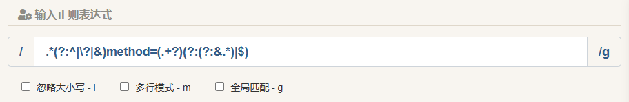

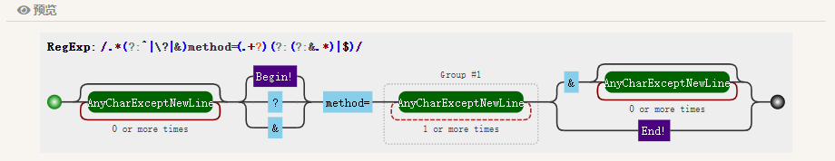

通过图形和正则语法可以解读出上述的正则的构造和含义如下：

* .*    表示配置除换行符以外的所有字符且不区分大小写
* (?:^|\?|&)    分为两部分 (?:) 和中间的 ^|\?|&
  * (?:)    是忽略捕获的子模式（参考上文中的正则表达汇总参考语法）只匹配但是不捕获字符
  * ^|\?|&    表示以 ? 和 & 开头 其中\？是为问号添加了转义字符
* method=    表示直接匹配 method= 这些字符
* (.+?)    分为两部分 () 和中间的 .+?
  *  ()    是捕获 expr 子模式（参考上文中的正则表达汇总参考语法）匹配后可以使用变量引用
  * .+?    表示除换行符以外的所有字符，而且必须有一个（method=后没东西则不会命中正则）
* (?:(?:&.\*)|$)    分为两个部分(?:) 和中间的 (?:&.*)|$
  * (?:)    是忽略捕获的子模式（参考上文中的正则表达汇总参考语法）只匹配但是不捕获字符
  *  (?:&.\*)|$    又可以分为两个部分  (?:&.*)  和 $ 中间的 | 表示或
    *  (?:&.*)    表示以 &后跟着任意字符结尾
    * $    表示直接结束


按照正则表达汇总参考语法再结合图形化的正则表达式解读，可以更清楚的理解复杂正则表达式的含义，真的不理解也可以多收集收集相关NGINX的正则配置，看看就能应付大部分情况了


[Back To Toc](#nginx-notes)


### 处理跨域

A域名下，调用B域名下的某个接口，或请求B域名下的某项资源，需要在B域名下添加类似如下的配置

```nginx
server {
    listen 80;
    location / {
        # nginx 拦截 预校验请求 并返回成功状态204
        if ($request_method ~* OPTIONS) {
            add_header 'Access-Control-Allow-Origin' '*';
            add_header 'Access-Control-Allow-Credentials' 'true';
            add_header 'Access-Control-Allow-Methods' 'GET POST';
            add_header 'Access-Control-Allow-Headers' '*';
            return 204;
        }
        # 配置调用方域名 允许跨域
        add_header 'Access-Control-Allow-Origin' 'https://browsedomain.com';
        proxy_pass http://192.168.0.2:9081;
    }
}
```


[Back To Toc](#nginx-notes)


### 密码认证

生成密码

在当前目录生成文件名为auth的认证文件，用户名为username，密码是执行下面的命令后提示需要输入的密钥

```bash
htpasswd -c ./auth username
```

添加NGINX配置

```nginx
server {
    listen 80;
    # 也可以放在 location 下
    auth_basic "请输入认证信息";
    auth_basic_user_file auth;
    ...
}
```


[Back To Toc](#nginx-notes)


### 安全配置

记录一些安全配置

避免点劫持漏洞（X-Frame-Options）

*  add_header X-Frame-Options SAMEORIGIN;
  * 效果：同源域名才可以进行调用和iframe嵌入
*  add_header X-Frame-Options ALLOW-FROM https://test.com;
   *  效果：被ALLOW的地址iframe才可以嵌入
   *  **注意**：
      *  这是一个被废弃的配置，在较多的老版本浏览器均不适用，添加后需要进行测试！
      *  可以使用 Content-Security-Policy: default-src https://test.com; 替代 ALLOW-FROM


避免[XSS](https://developer.mozilla.org/en-US/docs/Glossary/Cross-site_scripting)攻击

* add_header  Content-Security-Policy: default-src 'self' https://test.com; 
  * 效果：只允配置项进行资源请求或脚本调用，详细参考 [Content-Security-Policy 文档](https://developer.mozilla.org/zh-CN/docs/Web/HTTP/Headers/Content-Security-Policy)

对抗协议降级和Cookie劫持攻击

* add_header Strict-Transport-Security "max-age=63072000; includeSubdomains; preload;"
  * max-age：设置浏览器收到请求后多少秒内凡是访问这个域名必须使用HTTPS
  * includeSubdomains：可选，当前规则使用所有子域名
  * preload：可选，加入预加载列表

CSRF和防盗链

* valid_referers

  * none：valid_referers 后包含none，表示 不包含 Referer 头的请求可以通过校验 
  * blocked：valid_referers 后包含blocked，表示 Referer 头中不包含 http或https的请求可以通过校验 
  * server_names：valid_referers 后包含server_names，表示 Referer 头中**只有包含** 当前server的server_name 或 server_names 后的正则匹配域名或实际域名 的请求可以通过校验 
  * **注意**：
    * 不论是 referers 或者 host 头都可以被篡改绕过校验，这种方式避免CSRF不是百分百可靠
    * 建议使用 post 方式处理所有关键请求
    * 建议使用 token 认证，不使用 cookie 认证

* 参考配置

  ``` nginx
  valid_referers none blocked server_names
                 *.example.com example.* www.example.org/galleries/
                 ~\.google\.;
  
  if ($invalid_referer) {
      return 403;
  }
  ```

* 或直接if限制 host头，参考配置

  ```nginx
  if ($http_Host !~* ^(test1.com|test2.com)$ ) {
      return 403;
  }
  ```

  

[Back To Toc](#nginx-notes)


### 压缩配置

Nginx对前端资源的压缩分为两种，动态压缩和静态压缩

* 动态压缩
  * 由 nginx ngx_http_gzip_module 处理，属于默认模块
  * 当Nginx向浏览器返回资源文件时，虽然文件本事并不是.gz结尾，Nginx会消耗CPU资源进行压缩，再将压缩后的内容返回给浏览器

* 静态压缩
  * 由 nginx ngx_http_gzip_static_module 处理，不是默认模块
  * 基于前端框架的项目在打包过程中资源会根据配置构建生成.gz结尾的文件，项目在Nginx部署后，对于资源请求Nginx将直接返回压缩包

可以通过响应头可以判断资源是否被压缩，以谷歌浏览器为例，F12打开控制台后，请求信息栏中右键选择响应头，选择Content-Encoding，添加展示Content-Encoding头信息，其中为gzip则表示当前资源开启了gzip压缩，无则没有开启

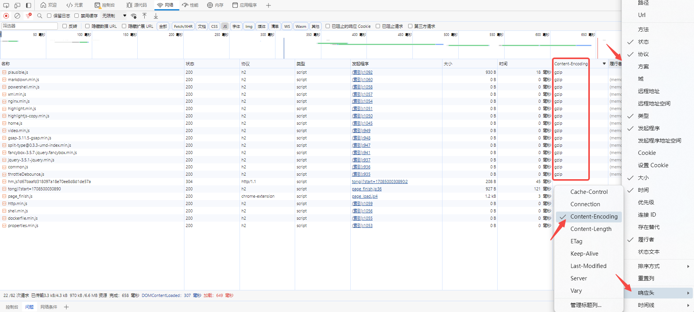

**动态压缩**

NGINX Gzip配置

```nginx
http {
	...
	# 开启 gzip
    gzip on;
    # 设置最小的压缩配置 小于1k 不做gzip压缩 
    gzip_min_length 1k;
    # 设置压缩缓冲区 4 块 每块大小16k
    gzip_buffers 4 16k;
    # 开启gzip的 http请求协议
    # 默认 1.1
    # 在多层nginx嵌套下要注意这里的设置 nginx —> nginx(upstream) 之间默认是 http 1.0 和gzip_http_version的默认值不匹配
    # 上述情况 需要在上游nginx中设置 gzip_http_version 1.0
    gzip_http_version 1.1;
    # 压缩级别1-10 和 CPU 占用相关 数字越高CPU占用越高 5以上压缩大小没有明显提升 
    gzip_comp_level 5;
    # 压缩文件的类型
    # 这里需要注意 所设置的类型和后缀映射 必须在 mime.types 中存在 通常只对文本类文件进行gzip压缩
    gzip_types text/css text/xml text/plain application/javascript application/rss+xml font/woff font/woff2;
    # 设置当前nginx作为被代理节点时是否启用gzip
    # 其他代理节点向当前nginx请求文件且请求包含Via头(Via: XXX)时 gzip_proxied配置才会生效 gzip_proxied根据请求或响应头来判断是否开启gzip
    # 默认 off 可以同时设置多个
    # 可选的值 如下
	# any		所有被代理请求均开启Gzip
    # off		被代理时禁止Gzip
	# expired	响应头包含Expires 禁用Gzip
	# no-cache	响应头Cache-Control为no-cache 禁用Gzip
	# no-store	响应头Cache-Control为no-store 禁用Gzip
	# private	响应头Cache-Control为private 禁用Gzip
	# no_etag	响应头不包含ETag 禁用Gzip
	# auth		请求头包含Authorization 禁用Gzip
    # no_last_modified	响应头不包含Last-Modified 禁用Gzip
    gzip_proxied any;
    # 添加响应头 Vary: Accept-Encoding
    gzip_vary on;
    # 根据 User-Agent 禁用 gzip 下面当为 ie浏览器访问时 禁用gzip
    gzip_disable "MSIE [1-6]\.";
	...
}
```

**静态压缩**

需要根据实际的后缀文件设置 gzip_static

```nginx
server {
	...
	root   html;

	location ~ \.(js|mjs|json|css|html)$ {
        gzip_static on;
	}

	location / {
		try_files $uri $uri/ /index.html;
        index  index.html index.htm;
  	}
    ...
}
```


[Back To Toc](#nginx-notes)


### 真实IP透传

一些安全性较高的系统，在被NGINX代理后可能出现无法登录无法访问或403的问题，需要将真实IP透传到后端

例如一些报表系统，或者java client访问nginx代理后的minio server

```nginx
server {
    listen 80;
    location / {
        proxy_set_header Host $http_host;
        proxy_set_header X-Real-IP $remote_addr;
        proxy_set_header X-Forwarded-For $proxy_add_x_forwarded_for;
        proxy_set_header X-Forwarded-Proto $scheme;
        proxy_set_header X-NginX-Proxy true;
        
        # 设置真实IP的 http头 默认 X-Real-IP
        # 一般不需要使用 real_ip_header 
        # 如果需要调整真实ip的http头 nginx需要增加编译参数 --with-http_realip_module
        # real_ip_header X-Real-IP;
        # real_ip_header X-Forwarded-For;
        proxy_pass http://192.168.0.2:9000;
    }        
} 
```


[Back To Toc](#nginx-notes)


### 区分浏览器

一些网络通道短时间难以打通的话，可以通过浏览器区分不同系统

```nginx
server{
    listen 8081;
    location / {
        if ($http_user_agent ~* "Edg") {
            proxy_pass http://backend1;
        }
        if ($http_user_agent !~* "Edg") {
            proxy_pass http://backend2;
        }
    }
}
```


[Back To Toc](#nginx-notes)


### Cookie设置

NGINX多层代理之后系统Cookie设置可能存在问题，记录一下set cookie出现的问题和解决方法

问题：secure 标记导致cookie无法设置

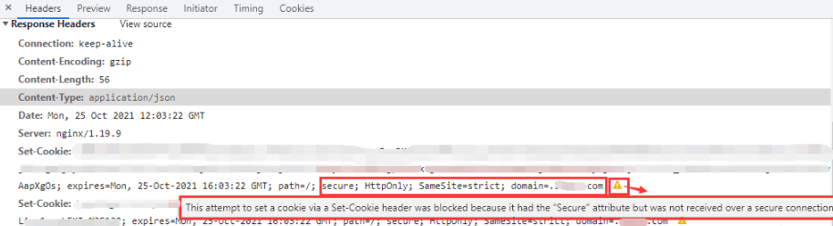

```nginx
server{
	···
    # 删除cookie中的 secure 标记
    proxy_cookie_flags ~ nosecure;
    ···
}
```


[Back To Toc](#nginx-notes)


### Websockets

NGINX代理一些 如Grafana、Minio console等 使用websocket的系统时，需要增加如下的配置使NGINX支持 http协议升级为 websocket

```nginx
# map 最好放在nginx.conf主配置文件中
map $http_upgrade $connection_upgrade{
    default upgrade;
    '' close;
}

server {
    listen 80;
    location / {
            proxy_http_version 1.1; 
            proxy_set_header Upgrade $http_upgrade;
            proxy_set_header Connection "upgrade";
            proxy_pass http://192.168.0.2:9001;
    }        
} 
```


[Back To Toc](#nginx-notes)


### 代理UDP协议

```nginx
server {
    # 代理UDP协议时
    # proxy_timeout proxy_responses 组合控制会话时间
    # 当未超过 proxy_responses 设置的回包数时 时间超过 proxy_timeout 结束会话
    # 当超过 proxy_response 设置的回包数时 即可结束会话
    
    listen 53 udp reuseport;
    # UDP 这项配置应该无效
    # proxy_connect_timeout 1s;
    proxy_timeout 3s;
    # 代理DNS UDP 需要配置 
    proxy_responses 1;
    proxy_pass 1.1.1.1:53;
}

server {
    listen 54 udp reuseport;
    proxy_timeout 3s;
    proxy_pass 1.1.1.2:53;
    # 代理UDP时 有一种场景
    # A -UDP- NGINX -UDP- B
    # B 回包的时 会直接请求A 而不经过NGINX 这不是期望的情况
    # 期望：B -> NGINX -> A
    # 实际：B -> A	(跳过NGINX)
    # 这时 可以通过 proxy_bind 修改请求的源地址为NGINX VIP 
    # 实现：B -> NGINX -> A
    proxy_bind nginx_vip_address transparent;
}
```


[Back To Toc](#nginx-notes)


### MAP控制上游

可以根据需求调整 匹配的变量 

下例中使用 $remote_addr 匹配实现不同IP到不同的上游

```nginx
map $remote_addr $next {
    ~1.1.1.1 next;
    ~1.1.1.2 next;
    ~1.1.1.3 next;
    ~1.1.1.4 next;
    default  default-next;
}

upstream next {
    server 1.1.1.5;
}

upstream default-next {
    server 1.1.1.6;
}

server {
    listen 80;
    server_name localhost;
    proxy_pass http://$next;
}
```


[Back To Toc](#nginx-notes)


### 其他配置/资料

#### location 失效

``` nginx	
server {
    # ...
    set $test www.test.com
    
    # 当 proxy_pass 包含变量时 location 替换请求路径的功能会失效
    # 例如请求路径为 /test/api/xxx  期望NGINX处理后 转发路径为 /api/xxx 
    # 如下的配置就不能实现    
    # location /test/ {
    #	 proxy_pass https://$test;
    #    proxy_set_header Host $test;
    # }
        
    # 使用正则处理这种情况
    location ~ /test/(.*) {
    	proxy_pass https://$test/$1;
        proxy_set_header Host $test;
    }
    # ...
}
```


[Back To Toc](#nginx-notes)


#### location 详解

> 内容引用自 [nginx的location与proxy_pass指令超详细讲解及其有无斜杠( / )结尾的区别 - 顾志兵 - 博客园 (cnblogs.com)](https://www.cnblogs.com/sandgull/p/column-nginx-config_of_location_and_proxy_pass_and_the_difference_of_absence_of_tail_slash.html)
>
> 结合自己理解稍作调整

##### 匹配模式

根据location后的符号，匹配模式分为三类，分别是：**前缀匹配**、**精确匹配**和**正则匹配**，详细说明如下：

- 无或空
  即不指定任何匹配模式符号，此时，它代表**前缀匹配**。比如 location /books/ { ... }，它可以匹配/books/index.html、/books/computer/GitDefinitiveGuide.pdf

- **=**
  符号 = 代表**精确匹配**，要求请求的uri与该符号后的uri样式完全一样，比如 location = /books { ... }，它可以精确的匹配/books这样的uri，像/books/、/books/index.html、/books.doc、/booksmark.pdf这样的uri均无法匹配。

  精确匹配一旦成功，则整个匹配过程结束，不再继续尝试匹配其它的location

- **~**
  符号 ~ 代表**正则匹配**，并且是区分大小的。比如 location ~ \.(gif|jpg|PNG)$ { ... }，它可以匹配/red-rock.jpg和/img/pigion.gif，但不能匹配/img/greatwall.png，因为这里的png是小写的，而 ~ 匹配的字符是大小写敏感的。

- **~***
  符号 ~* 代表**正则匹配**，并且它不区分大小的。比如 location ~* \.(gif|jpg|PNG)$ { ... }，它可以匹配/red-rock.jpg和/img/pigion.gif，或可以/img/greatwall.png，尽管这里的png是小写的，但 ~* 匹配不区分大小写，依然可以匹配。

- **^~**
  符号 ^~ 代表的匹配规则很特别，它看上去像是一个正则匹配，实则不是，它依然代表的是**前缀匹配**，与默认的前缀匹配（即没有任何符号的那种）的区别是：假定一个server内配置了多个前缀型的location和多个正则location，如果这些前缀location中，最终匹配的location是一个 ^~ 的话，则不再尝试后续的正则匹配。

  简而言之，^~就是一个禁止做正则匹配的前缀匹配，从它的功能定义上来看，这个^~符号改成!~更形象些，毕竟感叹号!就代表否定的意思，而^本身就是一个正则表达式的特殊符号，很容易引起误会。

##### 处理流程

location指令的处理流程，总体上分类三个阶段，分别是：uri规范化处理、uri匹配、后置处理，详细说明如下：

1. uri规范化处理
   这一步是处理原始uri串中不规范的内容，将其规范花后，方便后续做匹配，这些处理包括：

   - 解码 &xx 这样的url编码字符
   - 解析 . 和 .. 到这些符号所引用的目录上，比如/comment/top/../top100，处理后会变成/comment/top100
   - 将多个连续的/压缩成一个，比如/films/science-fiction///wandering-earth，处理后会变成/films/science-fiction/wandering-earth

2. uri匹配
   uri匹配有前面提到的三种类型，即：精确匹配、前缀匹配和正则匹配。假定一个server配置中，有多个精确匹配的location、多个前缀匹配的location和多个正则匹配的location。则整个匹配流程是这样的：

   - 先做精确匹配，按照精确匹配location在配置文件中的出现顺序进行，一旦命中一个，则整个匹配过程结束。

   - 若精确匹配没有命中，则执行前缀匹配，按照配置文件中前缀location出现的顺序执行，如果命中多个，则只记录location配置内容最长的那个。
     假定有两个前缀配置分别是：location /films/ { ... } 和 location /films/nature/ { ... }。请求地址/films/nature/aerial-view-of-china.mp4与这两个前缀locaton配置均能匹配，但最终将只保留第二个匹配，因为它的配置前缀（即/films/nature）最长。由此可以推断出，默认的配置（即 location / { ... } ）一定是兜底的匹配，当所有其它类型的匹配均未命中时，它一定能命中。

   - 接着再按照配置文件中的顺序，执行正则匹配，与前缀匹配不同的是：一旦命中一个正则匹配，整个匹配就结束了，不再对后面的正则location进行匹配。并且整个匹配的结果就是这个正则location。如果没有一个正则命中，则整个匹配的结果就是上面前缀匹配中，记录的那个location内容最长的命中结果。
     假定有两个正则配置分别是：location ~* \.(jpg|gif|png)$ { ... } 和 location ~* \.(png|jpeg|svg)$ { ... }。请求地址/img/logo.png将只会与第一个匹配，尽管它也满足第二个正则表达式，但由于第一个正则的位置在前，并且匹配成功，因此就不再进行后面的匹配了。

     > ⚠️ 例外情况：
     > 有一个特殊的前缀匹配，即：^~，如果在前缀匹配结束后，命中的location是用 ^~ 修饰的，就不会进入正则匹配阶段了。

3. 后置处理
   在uri匹配结束后，便执行命中location指令中，花括号{}内的指令。主要有两类，要么是从root指令配置的目录下查找相应的文件，要么执行其它代理类指令，例如proxy_pass

##### 匹配修饰符对比

表格对比更加直观，其中的优先级数字1、2、3，是数字越小，优先级越高

|        |        |            |            |                |                                                              |
| ------ | ------ | ---------- | ---------- | -------------- | ------------------------------------------------------------ |
| 修饰符 | 优先级 | 是否为正则 | 区分大小写 | 命中后继续匹配 | 备注                                                         |
| =      | 1      | ❌          | ✔️          | ❌              |                                                              |
| ^~     | 2      | ❌          | ✔️          | ✔️              | 在整个前缀匹配结束后，如果最终结果是一个^~修饰的location, 则不进行后续的正则匹配 |
|        | 2      | ❌          | ✔️          | ✔️              | 第一列没有内容，因为没有任何字符，其含义就是前缀匹配         |
| ~      | 3      | ✔️          | ❌          | ❌              |                                                              |
| ~*     | 3      | ✔️          | ✔️          | ❌              |                                                              |

##### 精确匹配优化

通常情况下，server里都会有一个location / {...} 这样的配置，它可以匹配所有的请求。如果一个网站的首页访问最频繁，比如http://localhost/，但该网站却配置了非常多的location，那么首页uri这个请求，需要在匹配完所有的location后，才能得出最终命中的location为 / 。在此期间，其它的那些匹配尝试明显是多余的。为此，可能通过为 / 提供一个精确匹配来提高性能，就像下面这样：

```nginx
location = / {
    ...
}
location / {
    ...
}
```


[Back To Toc](#nginx-notes)


#### proxy_pass 后置处理

location 和 proxy_pass 的uri转化规则很容易忘记，记录一下

**关注proxy_pass后是否存在 / 或 /xxx**

```nginx
server {
    listen 80;

    #请求url http://localhost/a/b/c/d

    #配置1
    #proxy pass 后地址 http://localhost/c/d
    location /a/b/ {
            proxy_pass http://localhost:8080/;
    }

    #配置2
    #proxy pass 后地址 http://localhost/a/b/c/d
    location /a/b/ {
            proxy_pass http://localhost:8080;
    }

    #配置3
    #proxy pass 后地址 http://localhost/ec/d
    location /a/b/ {
            proxy_pass http://localhost:8080/e;
            proxy_set_header X-Real-IP $remote_addr;
    }

    #配置4
    #proxy pass 后地址 http://localhost/e/c/d    
    location /a/b/ {
            proxy_pass http://localhost:8080/e/;
            proxy_set_header X-Real-IP $remote_addr;
    }    
}
```


[Back To Toc](#nginx-notes)


#### root 和 alias

```nginx
server {
    listen 80;
    
    # root 和 alias 的主要区别就是 是否拼接location做目录 寻找静态资源文件
    
    # http://localhost/static/image.jpg
    # html/www/static/image.jpg
    location /static/ {
        root html/www/;
    }

    # http://localhost/static/image.jpg
    # html/www/image.jpg
    location /static/ {
        # 注意alias后 路径需要加 /
        alias html/www/;
    }
}    
```


[Back To Toc](#nginx-notes)


#### try_files

try_files 在不是哈希路由的前端项目用的比较多，需要配置try_files 在当页面刷新时，重新定位到index.html 否则会404

```nginx
server {
    listen 80;
    
    location / {
        index  index.html index.htm;
        # 正常请求 html/test 目录下的资源
        root html/test;
        # 如果请求路径为 http:/localhost/home
        # 依次尝试请求root配置的目录文件 html/test/home html/test/home/index.html html/test/index.html
        try_files $uri $uri/ /index.html;
    }
}
```


[Back To Toc](#nginx-notes)


#### proxy_redirect

当服务端返回的重定向地址并不是期望的地址时 需要使用proxy_redirect 用于调整返回的 location

```nginx
server {
    listen 80;
    
    location / {
        proxy_pass http://192.160.0.3:80;
        # 重新向地址 调整为http 且 修改域名为 test.com
        proxy_redirect ~^http://test.dev(.*) https://test.com$1
        # 通常重定向后 如果cookie参与了认证流程 大概率需要nginx 进行cookie的调整
        # proxy_cookie_domain
    }
}
```


[Back To Toc](#nginx-notes)


#### proxy_cookie_domain 

NGINX在代理 依赖cookie认证模式的系统时，服务端返回的cookie domain并不一定和NGINX代理后的地址相同，cookie domain 和浏览器访问地址不同会导致写入cookie被阻止，这时就需要使用 proxy_cookie_domain 命令调整服务端返回的cookie

```nginx
# 127.0.0.1:8080 代理 test.com 
server {
    listen 8080;
    location / {
        proxy_set_header Host test.com;
        proxy_pass http://192.160.0.2:80;
        proxy_cookie_domain ~\.?test.com 127.0.0.1;
    }
}
```


[Back To Toc](#nginx-notes)


#### proxy_protocol

记录一个不太常见的配置

proxy_protocol 表示开启NGINX支持 proxy protocol 协议

> proxy_prorocol 是一种透传协议，可以更方便的获取请求源地址;
>
> 相关文档：[haproxy.org/download/1.8/doc/proxy-protocol.txt](https://www.haproxy.org/download/1.8/doc/proxy-protocol.txt)

开启协议后可以通过变量获取 proxy protocol 请求的信息 例如：

$proxy_protocol_addr、$proxy_protocol_port、$proxy_protocol_server_addr、$proxy_protocol_server_port 等

```nginx
server {
    listen 80 proxy_protocol;
}
```


[Back To Toc](#nginx-notes)


#### reuseport

reuseport 是提升nginx性能比较关键的配置，放在listen配置后，如下

reuseport 是启用内核 SO_REUSEPORT 功能的配置

该功能允许多个进程/线程 bind/listen 相同的 IP/PORT，提升了新链接的分配性能

详细参考官方对 reuesport 的解释：[Socket Sharding in NGINX OSS Release 1.9.1](https://www.nginx.com/blog/socket-sharding-nginx-release-1-9-1/)

```nginx
server {
    listen 80 reuseport;
}
```

为nginx设置1080端口，两个工作进程，测试开启 reuseport 前后的 socket 变化

```bash
# 1080 未添加 reuseport
# master 只创建一个 socket bind listen 1080
# worker 进程拷贝 master 所以有 3个 socket
[nginx@nginx conf]$ lsof -i:1080
COMMAND   PID  USER   FD   TYPE  DEVICE SIZE/OFF NODE NAME
nginx   32906 nginx    5u  IPv4 8355385      0t0  TCP *:socks (LISTEN)
nginx   37791 nginx    5u  IPv4 8355385      0t0  TCP *:socks (LISTEN)
nginx   37792 nginx    5u  IPv4 8355385      0t0  TCP *:socks (LISTEN)
[nginx@nginx conf]$ netstat -atnp | grep 1080
(Not all processes could be identified, non-owned process info
 will not be shown, you would have to be root to see it all.)
tcp        0      0 0.0.0.0:1080            0.0.0.0:*               LISTEN      32906/nginx: master 
# 修改配置 1080 添加 reuseport
[nginx@nginx conf]$ vim nginx.conf
[nginx@nginx conf]$ ../sbin/nginx -s reload
# 由于设置两个工作进程 nginx master进程分别创建两个 socket 并且设置 so_reuseport 再对1080端口进行 bind 和 listen
# 当nginx worker进程 fork master进程时 对应也拷贝了相应的socket
# 实现了多个进程 独自bind listen相同的端口
[nginx@nginx conf]$ lsof -i:1080
COMMAND   PID  USER   FD   TYPE  DEVICE SIZE/OFF NODE NAME
nginx   32906 nginx    5u  IPv4 8355385      0t0  TCP *:socks (LISTEN)
nginx   32906 nginx    8u  IPv4 8378295      0t0  TCP *:socks (LISTEN)
nginx   38492 nginx    5u  IPv4 8355385      0t0  TCP *:socks (LISTEN)
nginx   38492 nginx    8u  IPv4 8378295      0t0  TCP *:socks (LISTEN)
nginx   38493 nginx    5u  IPv4 8355385      0t0  TCP *:socks (LISTEN)
nginx   38493 nginx    8u  IPv4 8378295      0t0  TCP *:socks (LISTEN)
```

还需要注意一点，当reuseport打开时，**accept_mutex** 配置是被忽略的


#### accept_mutex

Nginx 互斥锁配置，accept_mutex主要时为了解决“惊群效应”带来的问题，如果开启Nginx工作进程会串行工作处理新的连接，否则将会以类似广播的方式处理新连接，**1.11.3版本后默认 off**

互斥锁属于性能优化配置，个人认为已经过时，如果考虑优化Nginx性能，优先使用reuseport，不启用此项配置

在高版本的linux中（4.5后），惊群问题已经由系统层面解决，Nginx也将默认 accept_mutex 默认on 转为 off

参考:[epoll: add EPOLLEXCLUSIVE flag · torvalds/linux@df0108c · GitHub](https://github.com/torvalds/linux/commit/df0108c5da561c66c333bb46bfe3c1fc65905898)

引用官方对开启 accept_mutex的建议

> There is no need to enable `accept_mutex` on systems that support the [EPOLLEXCLUSIVE](https://nginx.org/en/docs/events.html#epoll) flag (1.11.3) or when using [reuseport](https://nginx.org/en/docs/http/ngx_http_core_module.html#reuseport).

```nginx
events {
    worker_connections 4096;
    
    # 配置举例 非特殊情况不需要启用
    accept_mutex on; 
    accept_mutex_delay 100ms;
}
```


[Back To Toc](#nginx-notes)


#### worker_connections

worker_connections，设置**单个工作进程**可以允许**同时**建立外部连接的数量，数字越大，能同时处理的连接越多，这里的外部链接**不仅仅是来自客户端的，也包括向上游发起的建链**

当 Nginx **仅**作为WEB服务器时，设置为系统最大打开文件数即可

当 Nginx **仅**作为反向代理服务器时，至多为 1/2 系统最大打开文件数

其他情况可以设置为近似的中间值，例如最大打开文件数为 65535，可以调整 worker_connections 为 20960

需要注意的是，在默认的nginx.conf配置中 worker_connections 是 1024，这个配置对于生产环境是非常危险的，稍频繁的网站 1024 的设置远远不够

这个值主要更具内存和操作系统进程最大打开文件数进行设置

* 一般情况下，以现在的计算机硬件水平不需要考虑连接带来的内存影响，除非设置的值真的非常非常大
* 可以通过  ulimit -n 查询最大打开文件数，可能是1024 或者 65535
* 可以通过 cat /proc/nginx_woker_pid/limits 查看当前工作进程的最大打开文件数
* 也可以通过 nginx 配置（worker_rlimit_nofile）调整**worker进程**的最大打开文件数（**需要使用特权用户运行nginx，如root**）

```nginx
worker_processes 2; 
worker_rlimit_nofile 65535;
events {
   worker_connections 65535; 
}
```

在 worker进程收到的连接已经超过 woker_connections 设置的值后，新的连接会进入排队状态，当超过内核参数 net.core.netdev_max_backlog 设置的数据包最大排队数后，将不再接收新的连接，客户端请求将会失败


[Back To Toc](#nginx-notes)


#### tcp_nodelay

在**长连接**的情况下，tcp_nodelay 能够解决小包阻塞的问题，**默认 on**，即关闭  TCP Nagle 算法

要理解这项配置的含义需要了解TCP传输中的 Nagle 和 Delayed Ack

Nagle算法规定，在发送数据包时，满足以下任意一个条件时才允许发送（Nagle算法降低了网络中小包的数量，假如实际数据只有1KB，被立即发送时会携带40KB的包头，大量小包被发送时 payload 利用率低，严重会导致网络瘫痪）

* 积累的数据量到达最大的 TCP Segment Size（MSS）

* 收到了一个 Ack

Delayed Ack规定不针对单个包发送Ack，Ack在以下情况时发送（降低网络中ACK数量，提升网络性能）

* 一次确认两个包
* 发送响应时携带Ack
* 触发超时时间（40ms）后再发送Ack

发送方和接收方 Nagle 和 Delayed Ack 互相作用，在**连续发送两个包，立刻进行读操作时，会产生40ms的延迟**，通过下面的一段伪码来解释出现问题的这种情况

```markdown
# 当发送方启用 Nagle 接收方启用 Delayed Ack
# Nagle 算法逻辑
# 当有数据需要发送时
if there is new data to send
  # 假设 数据一共 四个包 前两大包（大于MSS） 后两个一个中包和一个小包（小于MSS，且小包不是包含Fin标志的包）
  # 步骤1：两个大包会被立刻发送 接收方也必须返回Ack 确认这两个大包
  if the window size >= MSS and available data is >= MSS
    send complete MSS segment now
  else 
    if there is unconfirmed data still in the pipe
      # 步骤3：最后一个小包数据小于 MSS 前一个中包未被Ack 存在未确认数据 
      # 最后一个 小包会进入缓冲 等待发送
      # 由于接收方遵循 Delayed Ack 会在40ms之后再发送Ack 所以这个小包会延迟40ms后被发送
      enqueue data in the buffer until an acknowledge is received
    else
      # 步骤2：中包被发送时发送数据小于 MSS 但是由于前两个大包被Ack没有待确认的数据 中包也会立刻被发送 
      send data immediately
    end if
  end if
end if
# 上述情况 会产生40ms的延迟 且上述情况只会发生在 连接状态为 keep-alive 时
# 在连接非持久的短链接情况下 最后的小包会随连接关闭立刻发送 
# 即短链接并不存在小包阻塞问题
```

综上，在Nginx启用长连接，tcp_nodelay 为 on 时能优化网络连接传输，建议不要设置成 off


[Back To Toc](#nginx-notes)


#### sendfile

sendfile配置是控制开启或关闭使用sendfile()，sendfile()是磁盘和传输控制协议之前的一种系统呼叫，它提供的”零拷贝(zero-copy)“机制

可以让数据直接从主机存储传送到网卡缓冲块中

正常情况下被发送的数据会首先通过read()呼叫从磁盘拷贝进系统高速缓冲存储器中（内存），再使用write()呼叫将缓冲区内容发送到网络，这个过程涉及两次上下文切换，会占用较多的CPU

在使用sendfile()呼叫时，数据会从磁盘直接进入网卡缓冲区，跳过了将数据拷贝进出系统高速缓冲存储器的过程，降低CPU占用

```nginx
http {
    ...
    # 生产环境 建议三者同时开启
    sendfile       on;
    tcp_nopush     on;
    tcp_nodelay	   on;

    server {
        ...
        # 也可以在location块中设置 sendfile
        location /video/ {
            sendfile       on;
            tcp_nopush     on;
            aio            on;
        }
        ...
    }
    ...
}
```


[Back To Toc](#nginx-notes)


#### tcp_nopush

通过设置tcp_nopush on，可以让nginx使用 TCP cork 机制，默认 off

启用后，可以使 Nginx 在一段时间内积累多个小的数据包，然后一次性发送它们

看似 tcp_nopush 和 tcp_nodely 是互斥的，个人理解这两项配置只是作用的层面不通，tcp_nodely 决定需不需要立刻发送包，而tcp_nopush 是对已经就绪发送的包进行阻塞，满足条件之后再进行发送，在介绍tcp_nodely的伪码内容中，假设tcp_nopush起作用，它就会阻塞第三个包（中包）的发送

Linux 2.5.9 以后的版本中，`tcp_nopush` 和 `tcp_nodelay` 是可以兼容的，两者同时作用进行网络传输优化

和系统层面相同，Nginx也可以同时配置 tcp_nopush on 和 tcp_nodelay on

个人理解在两者同时配置开启时，nginx首先会通过 tcp_nopush 确保每个数据包都被填满，最后一个包时 tcp_nodelay 生效将最后一个包强制发出而不进行等待和阻塞

```nginx
http{
    ...
    # 生产环境 建议三者同时开启
    sendfile on; 
    tcp_nopush on; 
    tcp_nodelay on; 
    ...
}
```


[Back To Toc](#nginx-notes)


#### multi_accept

个人建议 无需启用

```nginx
events {
    worker_connections 4096; 

    # 使用epoll事件模型
    use epoll;

    # 使用工作进程一直循环接受新网络连接请求 直到系统返回EAGAIN
	# 默认 off
    # 在连接没达到一定数量级时不要尝试开启 会造成连接分配不均衡
    # 参考NGINX核心开发者的邮件 https://forum.nginx.org/read.php?21,267183,267526#msg-267526
    multi_accept on; 
}
```


[Back To Toc](#nginx-notes)


## 常见的状态码问题分析

### 101

多见于websocket系统的场景，从http切换至更高协议时，会发送切换协议的请求，响应状态码即为101

曾经遇到过grafana的页面因为代理了好几层出现了问题，无法建立ws链接，但是监控大盘页面会一直发送101请求期望升级协议

总之大量的 101 状态请求是高协议切换失败造成的，为什么失败需要具体分析


[Back To Toc](#nginx-notes)


### 400

当客户端收到400的响应码，大概率是经过NGINX这层出现了问题

造成400的原因可能有

* 请求行和体超过 large_client_header_buffers 的限制
* 请求行包含未转义的特殊字符

曾经遇过一次生产事故，java代码中调整了String相关工具类，导致发给nginx的uri特殊字符没有转义，造成了nginx拦截请求并返回了400状态码


[Back To Toc](#nginx-notes)


### 408

408 多发生在大报文传输的请求上，例如附件上传

NGINX上可能导致408的配置主要有

client_body_buffer_size

client_body_timeout

client_header_timeout

调大相关配置后，大量408依然无法修复的话，唯一的可能就是网络设备丢包，可以通过在NGINX服务器上抓包确认丢包的问题

曾经遇过一次生产事故，在NGINX上找了半天原因，没有考虑到更前网络设备的 ping loss


### 413

client intended to send too large body : xxx bytes

调整配置 client_max_body_size 200m;


[Back To Toc](#nginx-notes)


## 常用软件代理转发配置

### Minio

```nginx
upstream minio-server {
	server 127.0.0.1:9000;
}

server {
    listen 9000;
    server_name  minio-server;

    location / {
        proxy_set_header X-Real-IP $remote_addr;
        proxy_set_header X-Forwarded-For $proxy_add_x_forwarded_for;
        proxy_set_header X-Forwarded-Proto $scheme;
        proxy_set_header Host $http_host;

        proxy_http_version 1.1;
        proxy_set_header Connection "";
        chunked_transfer_encoding off;

        proxy_pass http://minio-server;
        proxy_read_timeout 30s;
        proxy_send_timeout 30s;
    }
}


upstream minio-console{
	server 1.1.1.1:9001;
}
server {
    listen 9001;
    server_name  minio-console;

    location / {
        proxy_pass http://minio-console;
    }
    location /ws {
        proxy_http_version 1.1;
        proxy_set_header Upgrade $http_upgrade;
        proxy_set_header Connection $connection_upgrade;
        proxy_set_header Host $http_host;
        proxy_pass http://minio-console;
    }
}    
```


### Grafana

```nginx
server {
    listen 3000;
    server_name grafana;
    
    # 前缀是否是 grafana 根据实际 grafana 配置判断
	location ^~ /grafana {
        proxy_buffering on;
        proxy_buffers 100 200k;
        proxy_set_header Host $http_host;
        proxy_pass http://127.0.0.1;
        gzip on;
    }
    location ^~ /grafana/api/live {
        proxy_http_version 1.1;
        proxy_set_header Upgrade $http_upgrade;
        proxy_set_header Connection $connection_upgrade;
        proxy_set_header Host $http_host;
        proxy_pass http://127.0.0.1;
    }
}
```


[Back To Toc](#nginx-notes)


# ANGIE

为了支撑国密需求，安装ANGIE+铜锁

* Angie

> `Angie` is an efficient, powerful, and scalable web server that was forked from nginx:
>
> - Conceived by nginx ex-devs to extend the functionality far beyond the original.
> - Acts as a drop-in replacement for nginx without major configuration changes.
>
> We build binary packages for a range of [systems and architectures](https://angie.software/en/install/), as well as [Docker images](https://angie.software/en/install/#docker-images). The source code is open in our [public repositories](https://angie.software/en/a_contribution/) under a [BSD-like license](https://angie.software/en/license/). Dynamic nginx modules are compatible with Angie; in fact, we build a [number of them](https://angie.software/en/install/#dynamic-modules).

* 铜锁

> 铜锁/Tongsuo是一个提供现代密码学算法和安全通信协议的开源基础密码库，为存储、网络、密钥管理、隐私计算等诸多业务场景提供底层的密码学基础能力，实现数据在传输、使用、存储等过程中的私密性、完整性和可认证性，为数据生命周期中的隐私和安全提供保护能力。


## 编译

* 资源准备和前置操作

```bash
 mkdir -p /app/angie_build
 cd /app/angie_build
 curl -O https://download.angie.software/files/angie-1.3.1.tar.gz
 wget https://github.com/Tongsuo-Project/Tongsuo/archive/refs/tags/8.3.3.tar.gz
 tar -zxvf 8.3.3.tar.gz
 tar -zxvf angie-1.3.1.tar.gz
 cd angie-1.3.1
```

* 编译

```bash
./configure --prefix=/app/angie \
            --with-openssl=../Tongsuo-8.3.3 \
            --with-openssl-opt=enable-ntls  \
            --with-ntls \
            --with-http_ssl_module

# 列举一些其他模块
./configure --prefix=/app/angie \
            --with-openssl=../Tongsuo-8.3.3 \
            --with-openssl-opt=enable-ntls  \
            --with-ntls \
            --with-http_ssl_module \
            --with-http_flv_module \
			--with-http_mp4_module \
            --with-http_addition_module \
            --with-http_realip_module \
            --with-http_slice_module \
            --with-http_stub_status_module \
            --with-http_sub_module \
            --with-http_v2_module \
            --with-http_v3_module \
            --with-stream \
            --with-stream_geoip_module \
            --with-stream_realip_module


make -j
make install
```


[Back To Toc](#nginx-notes)


## 国密支撑

### 概念

什么是证书？

> 受访问的服务需要提供能证明自己身份的东西，就是证书。

什么是签名？

> 证书上的可信标识，叫做签名。

什么是CA?

> 第三方机构CA（certificate authority），CA通过对证书签名标识当前证书可信。

什么是国密算法?

> 国密算法是指国家密码管理局认定的一系列国产密码算法，包括SM1-SM9以及ZUC等。其中SM1、SM4、SM5、SM6、SM7、SM8、ZUC等属于对称密码，SM2、SM9等属于公钥密码，SM3属于单向散列函数。目前我国主要使用公开的SM2、SM3、SM4作为商用密码算法。

什么是双证书?

>**双证书是指国家商用密码体系中的双证书（加密证书+签名证书）**，而不是**站点部署自适应**的双证书（SM2算法证书+[RSA](https://so.csdn.net/so/search?q=RSA&spm=1001.2101.3001.7020)算法证书）。
>
>传统单证书，一个证书包含签名和加密功能，**双证书将这两项功能分开**，别需要签名证书和加密证书。加密证书只用来进行加密，签名证书只用来签名。

什么是单向双向？

> 简单一点理解，仅在服务端部署国密双证书为单向，服务端和客户端均部署双证书为双向。
>
> 
>
> **双向认证是指客户端对服务端证书进行认证的同时，服务端对客户端的身份也进行认证**。通常很多情况下浏览器会对服务端证书是否可信进行验证。而服务端对客户端的身份是不做限制的，如我们的常用的购物网站，视频网站等。无论你用手机还是用电脑只要输入正确的网址都可以正常访问。
>
> 
>
> 但是有些特殊的场景，为了安全性，服务端会鉴别客户端的身份，这时候就需要在双方握手的过程中，客户端需要将证明自己身份的证书传递给服务端。**如有些VPN设备，或政务网站需要用key才能进行登录，这很可能就启用了双向认证**


### 国密CSR

本地创建SM2签名私钥和CSR，CSR提供给证书签发机构申请签名证书和加密证书

```shell
# 检查openssl版本
# openssl 1.1.1+ 版本增加了对SM2 的支持
openssl version
# 确定 当前版本是否支持 SM2
openssl ecparam -list_curves | grep SM2

# 签名私钥
openssl ecparam -genkey -name SM2 -out signvip.key

# 生成CSR
openssl req -new -key signvip.key -out signvip.req
```


### 配置

- 开启 NTLS 功能

```nginx
listen ... ssl;
ssl_ntls  on;
```

- 配置国密证书

```nginx
listen ... ssl;

ssl_ntls  on;

# dual NTLS certificate
# sign.key 我们创建CSR的私钥
# sign.key 是签名证书
# enc.crt 是加密证书
# enc.key 是加密私钥 一般证书签发机构不会直接提供给你 可能会提供一串加密的txt文件 需要联系相关厂商解密成 key文件 例如CFCA
# 只在server 中配置 是单向国密
ssl_certificate      sign.crt enc.crt;
ssl_certificate_key  sign.key enc.key;

# can be combined with regular RSA certificate:
ssl_certificate  rsa.crt;
ssl_certificate  rsa.key;
```

- 配置国密套件

```nginx
# 确保下面配置中有这两个套件即可
ssl_ciphers "ECC-SM2-SM4-CBC-SM3:ECDHE-SM2-WITH-SM4-SM3";
```

- 配置国密回源

```nginx
location /proxy {
    proxy_ssl_ntls  on;

    proxy_ssl_certificate      sign.crt enc.crt;
    proxy_ssl_certificate_key  sign.key enc.key;

    proxy_ssl_ciphers "ECC-SM2-WITH-SM4-SM3:ECDHE-SM2-WITH-SM4-SM3:RSA";

    proxy_pass https://backend:443;
}
```


[Back To Toc](#nginx-notes)


# 备忘

自动生成文章TOC

```markdown
# 安装
https://github.com/ekalinin/github-markdown-toc.go
# 配置环境变量
# 文章目录下 cmd
# 执行
gh-md-toc --depth=4 README.md
```

